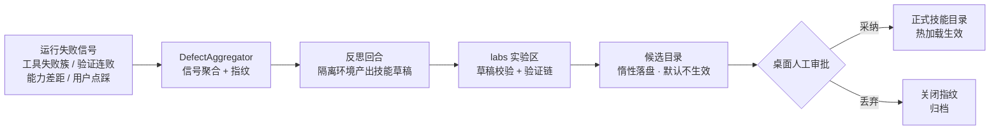
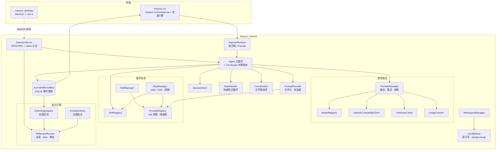

<p align="center">
  
</p>

<h1 align="center">Haoyue（浩玥）</h1>

<div align="center">

[](https://opensource.org/licenses/MIT)
[](https://dotnet.microsoft.com/)
[](https://www.npmjs.com/package/haoyue-cli)
[](https://github.com/Laogaodhck/haoyue/stargazers)
[](https://github.com/Laogaodhck/haoyue/network/members)
[](https://github.com/Laogaodhck/haoyue/issues)

**一个会自我反思的本地优先 AI Agent 平台**

Haoyue 是基于 .NET 10 构建的高性能 AI Agent，以事件溯源运行时为核心，提供终端 CLI 与桌面应用双前端。除完整的 Agent 能力（多提供商、工具执行、技能、MCP、知识库）外，Haoyue 内置了少见的**元认知层**：自动聚合失败信号、驱动反思回合产出技能草稿、经人工审批后热加载生效——Agent 在使用中持续变好。

[快速开始](#-快速开始) •
[功能特性](#-功能特性) •
[架构设计](#️-架构设计) •
[进化引擎](#-进化引擎) •
[English](README_EN.md)

</div>

---

## ✨ 功能特性

### 🏗️ Runtime First 架构

- **清洁架构**：`haoyue_runtime` 为核心，CLI 与桌面端是它的两个前端，关注点严格分离
- **常驻守护进程**：daemon 经 Named Pipe / Unix Socket 暴露 JSON-RPC，桌面端与 CLI 共享同一运行时、HTTP 连接池、熔断器与文件锁协调器
- **安全接入**：启动时生成随机握手 token（`~/.haoyue/daemon.token`，仅当前用户可读），客户端首条消息必须携带 token 认证，未认证连接立即拒绝
- **事件溯源**：关键事件（轮次、工具调用、用量、诊断、进化信号）写入 SQLite 事件日志（保留 5000 条），`events.recent` 可查询重放，重启不丢失
- **四层扩展**：Tools、Skills、Prompts、MCP（Model Context Protocol）插件机制

### 🤖 多提供商与模型

- **OpenAI 兼容 / Anthropic / Google**：主流云端模型开箱即用
- **本地模型**：Ollama、LM Studio，或直接进程内运行 GGUF 模型（无需任何服务器），支持 GPU 层卸载、KV 缓存量化、Flash Attention 与跨请求 KV 前缀复用；CUDA 12 后端实测解码提速 **11 倍**（7.6 → 84.9 tok/s）
- **本地多模态视觉**：GGUF 配套 mmproj 权重自动发现，本地模型可直接"看"对话中的图片与工具截图——带图请求自动降级 CPU 上下文规避上游 CUDA 慢路径，文本轮保持 GPU 全速
- **智能路由**：快速、均衡、质量、经济、离线多种策略，自动重试、指数退避与熔断器故障转移
- **用量统计**：Token 计数、成本与模型分布，桌面端图表可视化

### 🛠️ 工具与技能生态

- **内置工具**：文件读/写/编辑（diff 精确应用）、grep/glob、bash、网页搜索与抓取、任务规划、屏幕捕获
- **MCP**：stdio 与 SSE 传输，自动发现工具/提示/资源；提示注入有每服务器 24 个、总量 48 个的限额，超限原因在 MCP 状态中可见
- **技能系统**：目录式技能（`skill.yaml` + `prompt.txt`），manifest v2 支持触发关键词、工具白名单与参数收集；技能变更后扫描热加载，无需重启
- **多模态输出**：`image_generate` 图像生成（OpenAI 兼容 images/generations 端点，b64/url 双通道），产物落 `.haoyue/outputs/images/` 并可回灌视觉核验链；未配置图像模型时工具自动隐藏（本地扩散模型不在进程内推理能力内，可接 ComfyUI/SD 兼容网关，见 [部署与隔离 Runbook](haoyue_doc/runbooks/deployment-isolation.md)）

### 🧠 知识库与记忆

- **自动沉淀**：对话中自动保存 / 检索 / 遗忘知识
- **高容错检索**：同义词扩展、全半角归一化、CJK 二元分词与编辑距离兜底——错别字、中英混排也能命中；支持自定义同义词表热重载
- **语义检索层**：配置 embedding 能力模型后，知识检索自动升级为「词法 + 余弦相似度」混合排序（0.6/0.4 融合），向量按 (工作区, 词条, 模型) 缓存于 SQLite；任一环节失败自动整体退回纯词法方案——语义是增强，不是依赖。双通道接入：HTTP 走 OpenAI 兼容 /embeddings（Ollama / LM Studio / 云端均可）；本地 GGUF 嵌入模型（`capabilities.embedding = true`）直接进程内推理，零网络依赖
- **规则与记忆**：AGENTS.md 工作区规则自动注入（带来源信封、优先级钉死），MEMORY.md 长期记忆支持自动 / 手动管理
- **项目事实层**：`fact_save` 沉淀带来源、置信度、可选 TTL 的结构化短句事实（`.haoyue/facts.json`），自动注入后续回合并标注"待确认"，到期自动失效——介于 MEMORY.md 与知识库之间的中间记忆层

### 🤝 多代理协作

- **单任务委派**：`delegate_task` 在独立上下文与独立会话中运行子代理，深度由 `agent.delegationMaxDepth`（默认 1，上限 4）控制
- **并行 fan-out**：`delegate_tasks` 把 2-6 个独立子任务并行派发给多个子代理，一次返回按任务分节的聚合报告；并行子代理的文件写入经统一文件锁协调，且不得再委派

### 🔒 可靠性与安全（元数据层之下）

- **工具执行强制策略闸门**：每次工具调用在参数解析后、执行前经 `ToolExecutionPolicy` 强制评估（模型无法绕过）——用户 allow/deny 规则 + 内置 bash 高危守卫（根目录递归删除、磁盘擦除、fork 炸弹、curl|sh 远程执行、卷影删除等），命中即拒绝并落审计事件；`agent.toolPolicy` 配置
- **bash 命令审计**：每条执行的命令按内容前置风险分级（low/medium/high，含分级理由），完整记录（命令、目录、风险、结果、耗时）追加写入工作区 `.haoyue/audit/bash.jsonl`，永不轮转截断，可随时回溯追责
- **进程级沙箱（Windows Job Object）**：`agent.bashSandbox.enabled` 启用后，bash 命令整棵子进程树进入内核强制围栏——内存上限（默认 2GB/进程）、活动进程数上限（默认 256）、UI 限制（剪贴板/系统参数/显示设置/关机/桌面切换），kill-on-close 保证超时命令不留孤儿进程；网络隔离不在 Job Object 能力内，审计记录带沙箱标记——网络面由部署环境收口，方案见 [部署与隔离 Runbook](haoyue_doc/runbooks/deployment-isolation.md)（代理白名单 / 防火墙按程序阻断 / 容器化），自备 GGUF（含嵌入模型注册）同见该手册第 3 节
- **原子写**：配置与状态写入走「同目录临时文件 + 原子替换」，崩溃不产生半截文件；保存前做字段级 reload-merge，多端并发只保留各自的改动
- **单写者收敛**：CLI 的配置写操作自动委托给在线 daemon（`config.save`），离线才回退本地——彻底消除多写点竞争
- **提示预算**：上下文注入总量超 24k token 时按降级秩逆序丢弃（知识库 → 技能正文 → MCP → 目录/记忆），System/Developer 消息永不丢弃，丢弃动作在会话中明示
- **回合回滚（TurnScope）**：每个回合维护步骤账本与补偿栈，`write`/`edit` 的文件变更可一键撤销（`agent.undo`）；桌面端回合完成后出现撤销横幅；daemon 崩溃后启动对账，提示未完成回合的可恢复文件

### 📋 后台任务队列

- **长任务转后台**：daemon RPC `task.start` 提交完整 agent 回合后台执行（并发上限 4，硬超时保护），`task.get` / `task.list` / `task.cancel` 管理任务；终态经 `task.updated` 广播，会话持久化、进度可用 `events.recent` 重放——前端断开重连不丢进度

### 🖱️ Computer Use（电脑操作智能体）

- **完整 observe → act → verify 闭环**：`computer` 工具支持 18 种动作（鼠标移动/点击/拖拽、键盘输入、窗口管理、滚动等），每步自动截图回传模型核验结果
- **云端与本地模型都能"看屏幕"**：云视觉模型直接解析截图；本地 GGUF 模型经 mmproj 多模态接入同样可读图操作，不再只能靠无障碍文本盲操作
- **坐标自校准**：CoordinateMapper 屏幕标定 + `cursor_position` 自校准，DriverFaultSandbox 驱动容错，单回合 30 步上限兜底
- **系统操控子系统（SystemControl）**：`computer_exec`（跨平台 shell 解析——`auto` 按 OS 自动选 PowerShell/bash，`cmd` 仅 Windows、`bash` 仅 POSIX，POSIX 上的 powershell 需 pwsh；Python 检测与 sysinfo 同源：配置路径 → PATH → py 启动器/常见安装目录，并探测版本后缓存）+ `computer_scan`（硬件设备与文件夹结构扫描，按扫描结果定位后续操作）+ `computer_sysinfo`（系统配置、设置项与运行进程读取，含平台标识、shell 环境与 Python 版本报告）+ `computer_browser_repair`（浏览器主页劫持检测与自动修复——检测策略注册表/IE 起始页/Preferences JSON/Firefox prefs.js/快捷方式五类劫持源，修复前自动备份可回滚）
- **OS 自动识别与命令方言精准化**：运行时自动判定 Windows / Linux / macOS，模型无需猜测——`computer_exec` 对不支持的 kind 报出精确错误（指明当前 OS 与应改用的 kind），超时清树按平台选择 taskkill /T 或 entireProcessTree kill；`computer_sysinfo` 先行报告平台与 Python 版本，让后续命令直接用对方言编写
- **跨平台自动适配**：系统操控按 Windows / Linux 自动选择适配器（CIM 查询、注册表修复 vs /proc、lscpu、/etc 策略文件），权限不足的操作按失败项报告并给出提权指引，而非整体失败
- **默认休眠**：`computerUse.enabled` 默认关闭，开启需在桌面端设置中显式打开，并伴随全屏光晕提示；`systemControlEnabled` 可单独关闭系统操控而不影响鼠标键盘操控

### 🖥️ 桌面应用

- **现代界面**：Electron + Vue 3 + TypeScript，流式 Markdown、图片预览、推理深度调节
- **专家系统**：内置领域专家库，一键切换角色预设
- **图形化配置**：Provider、模型、Profile、MCP 服务器、本地推理加速全程可视化；「模型与提供商」页展示活动模型参数（上下文窗口/最大输出）与能力徽章（流式/工具/思考/视觉/推理）及全模型目录
- **定时任务**：cron 驱动的调度回合，失败即时桌面通知，支持 Webhook 回调
- **回合撤销与负反馈**：文件变更一键回滚；每条助手回答可点踩并附原因，反馈直接进入进化信号

### 💻 现代化终端体验

- **游戏式渲染**：30-60 FPS 双缓冲，流式输出、思考过程展示、工具状态与 Markdown 实时渲染，增量更新无闪烁

### 📁 工作区管理

- **项目识别**：自动识别 Git、.NET、Node.js、Python、Rust、Go、Unity、Vue 项目
- **隔离配置**：每个工作区独立的配置、缓存、会话与记忆
- **模板化初始化**：`haoyue init` 生成 AGENTS.md 与配置结构，模板可全局定制，已有文件从不覆盖

## 🚀 快速开始

### npm 安装 CLI（推荐）

自包含 .NET 二进制，无需单独安装 .NET SDK。当前提供 Windows x64。

前置要求：Node.js 18+、Git。

```powershell
npm install -g haoyue-cli

haoyue --version
haoyue              # 交互式聊天
haoyue "解释这个项目的架构"
haoyue doctor       # 健康检查
```

### 从源码构建

需要 .NET 10 SDK 与 Git：

```bash
git clone https://github.com/Laogaodhck/haoyue.git
cd haoyue
dotnet build

dotnet run --project haoyue_cli              # 交互式聊天
dotnet run --project haoyue_cli -- --continue  # 继续上一个会话
dotnet run --project haoyue_cli -- --model "openai/gpt-5.5"
```

桌面应用：进入 `haoyue_desktop`，`pnpm install && pnpm dev`。

## ⚡ 进化引擎

Haoyue 的元认知层让 Agent 在使用中持续改进，全流程**代码零改动、人工终审**：



- **四类信号**：同一（工具，错误）30 分钟内失败 ≥3 次；验证链连续失败 ≥3 次（含带病通过）；`declare_skill` 能力差距（单次即报）；用户点踩负反馈（每条独立成报告）
- **反思回合**：cron 或手动触发，在隔离运行时中分析缺陷报告，产出 `new-skill` / `revise-skill` 结论
- **实验区（labs）**：草稿必须写入 `~/.haoyue/labs/`，校验通过后晋升至 `~/.haoyue/skills-candidates/`——该目录不在技能扫描根内，**天然惰性**，审批前永不生效
- **防自喂养**：同一指纹的缺陷只处理一次（决策账本幂等）；反思回合自身的事件被聚合器排除，反思不会反思自己的反思
- **安全红线**：LLM 只允许产出技能层数据资产（`skill.yaml` / `prompt.txt`），禁止改动运行时代码与核心提示词；代码进化走人类流程

相关 RPC：`evolution.inspect`（查看缺陷报告）、`evolution.reflect`（触发反思）、`evolution.pending-list` / `evolution.decide`（审批）、`feedback.turn`（负反馈）。

## 🏗️ 架构设计



## 📁 项目结构

```
Haoyue/
├── haoyue_cli/           # CLI 前端
│   ├── Commands/           # CLI 命令（provider、model、knowledge、schedule 等）
│   ├── Ui/                 # 终端渲染引擎
│   └── Program.cs          # 入口点
├── haoyue_runtime/       # 核心运行时
│   ├── Agents/             # Agent 循环、上下文规划与 TurnScope 回滚
│   ├── ComputerUse/        # 电脑操作智能体（屏幕观察、鼠标键盘驱动、坐标标定、容错沙箱、SystemControl 系统操控子系统）
│   ├── Configuration/      # 配置管理（原子写、reload-merge、单写者桥接）
│   ├── Coordination/       # 文件锁协调器
│   ├── Daemon/             # 守护进程（JSON-RPC、RPC 路由、崩溃对账）
│   ├── Data/               # 数据层（知识库存储与语义检索、事实层、SQLite）
│   ├── Events/             # 事件总线与事件日志（SQLite 持久化）
│   ├── Evolution/          # 进化引擎（信号聚合、决策账本、反思回合）
│   ├── Experts/            # 专家系统
│   ├── Mcp/                # MCP 客户端（stdio/SSE、注入限额）
│   ├── Prompts/            # 提示加载、组合与预算强制
│   ├── Providers/          # LLM 提供商集成与熔断器
│   ├── Scheduling/         # 定时任务调度与后台任务队列
│   ├── Sessions/           # 会话持久化（SQLite）
│   ├── Skills/             # 技能管理（manifest v2、热加载）
│   ├── Tools/              # 工具注册和实现（含执行策略闸门、bash 审计与沙箱）
│   ├── Verification/       # 构建验证链
│   └── Workspaces/         # 工作区检测和管理
├── haoyue_desktop/       # 桌面应用（Electron + Vue 3 + TypeScript）
├── haoyue_webserver/     # 技能市场（Blazor Server + SQLite）
├── haoyue_website/       # 文档站源码（VitePress）
├── doc_toolkit/          # 模块化文档处理工具包（TXT/MD/PDF/DOCX 提取与互转 + OCR，见 doc_toolkit/README.md）
├── haoyue_tests/         # 运行时单元测试（681 用例，覆盖率门槛 ≥70%）
├── haoyue_cli_tests/     # CLI 测试
├── haoyue_doc/           # 设计与评审文档（见 haoyue_doc/README.md 索引，含 adr/ 与 runbooks/）
├── contracts/            # daemon 契约快照（DaemonContract 单源导出，JSON Schema 2020-12）
├── benchmarks/           # 评测 harness：本地模型评测（流畅性/速度/自修正/视觉）+ agent-eval Agent 级端到端评测
├── models/               # 本地 GGUF 模型（开发环境，不入库）
└── packaging/            # 打包脚本与配置
```

## ⚙️ 配置

### 全局配置

位于 `~/.haoyue/config.json`（所有写入原子化，多端并发只合并改动字段）：

```json
{
  "providers": {
    "openai": { "apiKey": "sk-...", "baseUrl": "https://api.openai.com/v1" }
  },
  "profiles": {
    "default": { "provider": "openai", "model": "gpt-5.5" }
  },
  "agent": {
    "maxSteps": 10,
    "maxRepairAttempts": 3,
    "autoVerify": true
  }
}
```

### 工作区配置

每个项目可在 `.haoyue/config.json` 中覆盖提供商与模型、温度与上下文、工具权限、技能与 MCP 服务器设置。

### 本地模型调优

```json
{
  "providers": {
    "local": {
      "kind": "local",
      "modelsDirectory": "~/.haoyue/models",
      "gpuLayers": 0,
      "threads": 8,
      "localPrefixReuse": true,
      "flashAttention": false,
      "kvCacheQuantization": "none",
      "mmprojPath": ""
    }
  }
}
```

- `gpuLayers`：GPU 卸载层数，默认 `0`（纯 CPU）；构建 CUDA 12 后端（`dotnet build -p:LlamaBackend=Cuda12`）后设 `999` 卸载全部层，实测解码 7.6 → 84.9 tok/s
- `mmprojPath`：多模态视觉投影权重（mmproj GGUF）路径；留空时自动发现模型目录下唯一 `*mmproj*.gguf`——必须与主模型同目录，且须使用与该模型配套的 mmproj 版本（如 gemma-4-E4B 配 unsloth 版 mmproj-F16）
- `localPrefixReuse`：跨请求复用 KV 前缀，多步回合只解码新增 token，吞吐显著提升（实测 TTFT 20.5s → 0.61s）
- `flashAttention` / `kvCacheQuantization`：注意力内核加速与 KV 缓存量化（`q8_0` / `q4_0`），量化仅在 Flash Attention 开启时生效
- 显存提示：8GB 显存 + 长上下文可能 OOM，届时下调 `gpuLayers` 或开启 KV 量化；带图请求会自动切换 CPU 上下文（规避上游 CUDA 多模态慢路径），文本轮保持 GPU 全速

以上参数也可在桌面端「设置 → 高级设置 → 本地推理加速」图形化配置。

## 🎯 使用示例

```bash
# 会话与提供商
haoyue session list && haoyue session resume <session-id>
haoyue provider add openai --api-key sk-...
haoyue model use openai/gpt-5.5

# 知识库与记忆
haoyue knowledge search "部署流程"
haoyue knowledge add "发布步骤" --tags 运维,发布
haoyue memory set "本仓库发布前必须跑全量测试"

# 定时任务（cron 驱动完整 Agent 回合）
haoyue schedule add "日报" "0 9 * * *" "汇总昨日提交生成日报"

# 评测回归
dotnet run --project benchmarks/agent-eval   # Agent 级端到端任务评测
```

会话数据保存在 `~/.haoyue/haoyue.db`，升级后旧格式会话自动导入。

## 🔌 扩展 Haoyue

### 添加工具

实现 `ITool` 接口并在 ToolRegistry 注册：

```csharp
public class MyTool : ITool
{
    public string Name => "my_tool";
    public string Description => "执行有用的操作";
    public JsonElement ParameterSchema => /* JSON schema */;
    public bool Mutating => false;
    public string StatusLabel => "正在运行我的工具";

    public async Task<ToolResult> ExecuteAsync(
        JsonObject args, ToolContext ctx, CancellationToken ct)
    {
        // 实现
    }
}
```

### 创建技能

```
skills/
  my-skill/
    skill.yaml          # 元数据和配置
    prompt.txt          # 提示模板
```

`skill.yaml` 支持可选 v2 字段控制注入行为：

```yaml
name: my-skill
description: 一句话描述这个技能什么时候用
triggers:            # 声明后仅当用户消息命中关键词才注入；不声明则常驻
  - 部署
allowed-tools:       # 注入期间可用的工具白名单；不声明则不限制
  - bash
parameters:          # 提示末尾追加参数收集说明
  - name: env
    description: 目标部署环境
    required: true
```

### MCP 服务器

在 `mcp/servers.json` 中配置 stdio 或 SSE 服务器；其提示与资源自动注册为上下文贡献，按 24k 总预算注入，每服务器最多 24 条提示、全局限 48 条，超限原因可在 MCP 状态中查看。

## 🧪 测试

```bash
dotnet test haoyue_tests      # 运行时测试（681 用例）
dotnet test haoyue_cli_tests  # CLI 测试

# 桌面端（需先 pnpm install）
cd haoyue_desktop && pnpm test && pnpm typecheck
```

haoyue_tests 带 70% 行覆盖率硬门槛（`coverage.runsettings`），契约快照漂移、Runbook 章节齐全性均有护栏测试强制。

## 📊 本地模型评测

[`benchmarks/local-model-eval/`](benchmarks/local-model-eval/) 内置可复现的评测 harness，走 runtime `LocalLlmClient` 真实链路，四个模式：

```bash
dotnet run --project benchmarks/local-model-eval -- fluency     # 对话流畅性
dotnet run --project benchmarks/local-model-eval -- speed       # TTFT / tok-s
dotnet run --project benchmarks/local-model-eval -- selfcorrect # 自修正闭环
dotnet run --project benchmarks/local-model-eval -- gputest     # GPU 卸载验证（HAOYUE_GPU_LAYERS 控制层数）
dotnet run --project benchmarks/local-model-eval -- visiontest  # 多模态视觉
```

gemma-4-E4B 实测报告见 [`本地模型评测报告-gemma-4-E4B-2026-10-07.md`](benchmarks/local-model-eval/本地模型评测报告-gemma-4-E4B-2026-10-07.md)。

## 📈 Agent 级评测

[`benchmarks/agent-eval/`](benchmarks/agent-eval/) 是 Agent 任务成功率的端到端回归 harness：6 个固定任务（文件写入、代码修复、多步编排、克制负向判分、策略闸门回归、读汇总）走真实隔离运行时链路，确定性文件断言判分，输出 Markdown + JSON 报告，非零退出码可直接接 CI——每次调整纠偏阈值或提示词后回归，调参不再靠手感。

```bash
dotnet run --project benchmarks/agent-eval          # 运行全部任务
dotnet run --project benchmarks/agent-eval -- --filter policy-guard   # 只跑策略闸门回归
```

## 📄 文档处理工具包

仓库内置独立工具包 [`doc_toolkit/`](doc_toolkit/README.md)：多格式文档的内容提取、格式互转与 OCR 识别，纯 Python、离线可用。

```python
from doc_toolkit import default_toolkit as kit

kit.extract_text("报告.docx")                       # 一步提取纯文本
kit.convert("notes.md", "docx")                    # 任意格式互转，保留标题/段落/列表结构
kit.recognize("截图.png", structured=True)          # OCR：每行文本 + 置信度 + 坐标
kit.parse("扫描件.pdf", ocr_fallback=True)          # 扫描件 PDF 逐页 OCR
```

- **统一中间模型（IR）**：解析器与渲染器只对接六种块类型（标题/段落/列表/引用/代码块/分隔线），新增格式零侵入——继承 `BaseParser`/`BaseRenderer` 后一行注册即接入全部互转链路
- **OCR**：RapidOCR（ONNX Runtime CPU 推理，模型内置完全离线），中文识别效果佳；模糊图片按置信度标记警告而非硬失败
- **明确错误体系**：格式不支持/文件损坏/内容为空等均抛带中文提示的专用异常
- 验证脚本：`verify_e2e.py`（23 项）与 `verify_ocr.py`（9 项），详见 [doc_toolkit/README.md](doc_toolkit/README.md)

## 📚 设计文档

架构评审、裁决与实施方案收录于 [`haoyue_doc/`](haoyue_doc/README.md)，包括：

- 状态并发、上下文边界与原子性风险评审（含修复对账）
- 工作流编排层架构裁决与 TurnScope 设计
- 进化引擎设计蓝图评审与落地设计（E1-E4）
- Agent 应用能力评估报告（G1-G7 欠缺项同日全量闭环：权限闸门、并行子代理、后台任务、语义检索、事实层、Agent 评测、bash 审计与沙箱、多模态输出）
- 跨语言契约治理（Contract First）、测试金字塔与覆盖率门槛
- NLP 与 HCI 全面优化评估报告、知识库优化说明
- ProviderManager 并发与参数审查

重大技术选型以 [ADR（架构决策记录）](haoyue_doc/adr/README.md) 文档化（已回填 7 篇），每个内置工具与官方技能配有 [Runbook 操作手册](haoyue_doc/runbooks/README.md)（护栏测试强制）。

## 📄 许可证

本项目采用 MIT 许可证 - 查看 [LICENSE](LICENSE) 文件了解详情。

## 👤 作者

**老高** · QQ：846193

---

**Haoyue** - 一个会自我反思的本地优先 AI Agent 平台。
