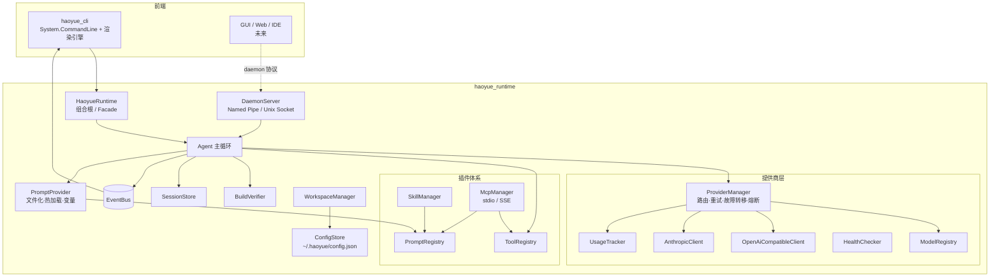

<p align="center">
  
</p>

<h1 align="center">Haoyue</h1>

<div align="center">

[](https://opensource.org/licenses/MIT)
[](https://dotnet.microsoft.com/)
[](https://www.npmjs.com/package/haoyue-cli)
[](https://github.com/Laogaodhck/haoyue/stargazers)
[](https://github.com/Laogaodhck/haoyue/network/members)
[](https://github.com/Laogaodhck/haoyue/issues)
[](https://github.com/Laogaodhck/haoyue/pulls)

**现代化、高性能的 AI Agent 运行时**

Haoyue 是基于 .NET 10.0 构建的高性能 AI Agent 运行时，采用清洁架构和事件驱动设计。它为构建 AI 驱动的编码助手提供了完整平台，支持多 LLM 提供商、工具执行、会话管理和流畅的终端交互体验。

[🌐 官方网站与文档](https://github.com/Laogaodhck/haoyue) •
[English](README_EN.md) •
[快速开始](#-安装) •
[功能特性](#-功能特性)

</div>

## ✨ 功能特性

### 🚀 Runtime First 架构

- **清洁架构**：以 `haoyue_runtime` 为核心，`haoyue_cli` 作为默认前端，关注点分离
- **插件系统**：通过 Tools、Skills 和 MCP（Model Context Protocol）实现可扩展性
- **事件驱动**：通过事件总线实现渲染与业务逻辑解耦

### 🤖 多提供商支持

- **OpenAI 兼容**：GPT-5.5、GPT-5.5-mini 及所有 OpenAI 兼容 API
- **Anthropic**：Claude Opus、Claude Sonnet、Claude Haiku
- **Google**：Gemini Pro、Gemini Flash
- **本地模型**：Ollama、LM Studio
- **智能路由**：快速、均衡、质量、经济、离线等多种策略
- **故障转移**：自动重试、指数退避和熔断器机制

### 🛠️ 工具生态系统

- **内置工具**：文件操作（读/写/编辑）、搜索（grep/glob）、bash 执行
- **MCP 支持**：stdio 和 SSE 传输，自动发现工具/提示/资源
- **技能系统**：基于目录的技能系统，支持提示注入和工作流

### 💻 现代化终端体验

- **游戏式渲染**：30-60 FPS 刷新率，双缓冲技术
- **流式输出**：实时 token 流式传输，显示思考/推理过程
- **实时 UI**：加载动画、进度条、工具状态和 Markdown 渲染
- **增量更新**：无闪烁、无滚动、平滑动画

### 📁 工作区管理

- **项目识别**：自动识别 Git、.NET、Node.js、Python、Rust、Go、Unity、Vue 项目
- **隔离配置**：每个工作区独立的配置、缓存和内存，会话按工作区作用域隔离
- **自动初始化**：自动创建 `.haoyue/` 目录结构

### 🔧 开发者体验

- **会话管理**：基于 SQLite 的会话持久化、恢复与并发访问
- **内存系统**：工作区特定的内存，自动上下文注入
- **验证机制**：代码修改后自动构建/检查/修复循环
- **热重载**：提示文件和配置无需重启即可重载

## 📦 安装

### 通过 npm 安装 CLI（推荐）

已发布到 npm 的 `haoyue-cli` 是自包含 .NET 二进制包，安装后可直接使用，无需单独安装 .NET SDK。当前 npm 包提供 Windows x64 平台二进制。

前置要求：

- Node.js 18 或更高版本
- Git（用于工作区检测）

```powershell
npm install -g haoyue-cli

# 验证安装
haoyue --version

# 进入交互式聊天
haoyue
```

也可以执行单次任务或管理命令：

```powershell
haoyue "解释这个项目的架构"
haoyue --continue
haoyue doctor
```

### 从源码构建

开发者从源码构建时需要：

- .NET 10.0 SDK 或更高版本
- Git（用于工作区检测）

```bash
git clone https://github.com/Laogaodhck/haoyue.git
cd Haoyue
dotnet build
```

### 从源码运行

```bash
# 交互式聊天模式
dotnet run --project haoyue_cli

# 单次提示
dotnet run --project haoyue_cli -- "解释这个项目的架构"

# 继续上一个会话
dotnet run --project haoyue_cli -- --continue

# 恢复特定会话
dotnet run --project haoyue_cli -- --resume <session-id>

# 覆盖模型
dotnet run --project haoyue_cli -- --model "openai/gpt-5.5"
```

## 🏗️ 架构设计



## 📁 项目结构

```
Haoyue/
├── haoyue_cli/           # CLI 前端
│   ├── Commands/           # CLI 命令（provider、model、profile 等）
│   ├── Ui/                 # 终端渲染引擎
│   └── Program.cs          # 入口点
├── haoyue_runtime/       # 核心运行时
│   ├── Agents/             # Agent 循环和上下文规划
│   ├── Configuration/      # 配置管理
│   ├── Events/             # 事件总线系统
│   ├── Mcp/                # MCP 客户端实现
│   ├── Prompts/            # 提示加载和组合
│   ├── Providers/          # LLM 提供商集成
│   ├── Sessions/           # 会话持久化
│   ├── Skills/             # 技能管理
│   ├── Tools/              # 工具注册和实现
│   ├── Verification/       # 构建验证
│   └── Workspaces/         # 工作区检测和管理
├── haoyue_tests/         # 单元测试
├── docs/                   # 文档
├── prompts/                # 提示模板（未来）
├── skills/                 # 技能定义（未来）
└── mcp/                    # MCP 服务器配置（未来）
```

## ⚙️ 配置

### 全局配置

位于 `~/.haoyue/config.json`：

```json
{
  "providers": {
    "openai": {
      "apiKey": "sk-...",
      "baseUrl": "https://api.openai.com/v1"
    },
    "anthropic": {
      "apiKey": "sk-ant-..."
    }
  },
  "profiles": {
    "default": {
      "provider": "openai",
      "model": "gpt-5.5"
    }
  },
  "agent": {
    "maxSteps": 10,
    "maxRepairAttempts": 3,
    "autoVerify": true
  }
}
```

### 工作区配置

每个项目可以在 `.haoyue/config.json` 中覆盖：

- 提供商和模型选择
- 温度和上下文设置
- 工具权限
- 技能配置
- MCP 服务器设置

## 🎯 使用示例

### 交互式聊天

```bash
haoyue chat
# 或直接
haoyue
```

### 单次任务

```bash
haoyue "将认证模块重构为使用 JWT"
haoyue "为 UserService 类编写单元测试"
haoyue "修复项目中的构建错误"
```

### 提供商管理

```bash
haoyue provider list
haoyue provider add openai --api-key sk-...
haoyue provider test openai
haoyue provider use anthropic
```

### 模型管理

```bash
haoyue model list
haoyue model use openai/gpt-5.5
haoyue model info claude-opus
haoyue model search "快速编码模型"
```

### 会话管理

```bash
haoyue session list
haoyue session resume <session-id>
haoyue session export <session-id> --format json
```

会话数据和 Desktop 项目列表统一保存在 `~/.haoyue/haoyue.db`。升级后首次访问工作区时，旧的 `.session/*.jsonl`、`.haoyue/sessions/*.jsonl` 或全局 `~/.haoyue/sessions/*.jsonl` 会自动导入，原文件保留为备份。Provider、模型、Profile、MCP、Skill、工作区配置仍使用原有 JSON/文本文件，用量记录仍为 `~/.haoyue/usage.jsonl`。

### 健康检查

```bash
haoyue doctor
```

## 🔌 扩展 Haoyue

### 添加工具

实现 `ITool` 接口：

```csharp
public class MyTool : ITool
{
    public string Name => "my_tool";
    public string Description => "执行有用的操作";
    public JsonElement ParameterSchema => /* JSON schema */;
    public bool Mutating => false;
    public string StatusLabel => "正在运行我的工具";
    
    public async Task<ToolResult> ExecuteAsync(
        JsonObject args, ToolContext ctx, CancellationToken ct)
    {
        // 实现
    }
}
```

### 创建技能

在 `skills/` 目录中创建：

```
skills/
  my-skill/
    skill.yaml          # 元数据和配置
    prompt.txt          # 提示模板
    tools/              # 可选的工具实现
```

### MCP 服务器

在 `mcp/servers.json` 中配置：

```json
{
  "servers": {
    "my-server": {
      "command": "node",
      "args": ["path/to/server.js"],
      "transport": "stdio"
    }
  }
}
```

## 🧪 测试

```bash
# 运行所有测试
dotnet test haoyue_tests

# 运行特定测试类
dotnet test haoyue_tests --filter "ClassName=ProviderTests"
```

## 📊 监控

Haoyue 包含内置监控：

- **使用统计**：Token 计数、成本、响应时间
- **健康检查**：提供商可用性和延迟
- **熔断器**：自动故障检测和恢复
- **会话分析**：对话历史和模式

## 📄 许可证

本项目采用 MIT 许可证 - 查看 [LICENSE](LICENSE) 文件了解详情。

## 🙏 致谢

- 使用 .NET 10.0 和 System.CommandLine 构建
- 使用 Spectre.Console 进行终端渲染
- 遵循清洁架构和垂直切片模式
- 采用 Native AOT 友好的设计理念

## 👤 作者

**老高** · QQ：846193

---

**Haoyue** - 基于现代化 .NET 的高性能 AI Agent 运行时。
