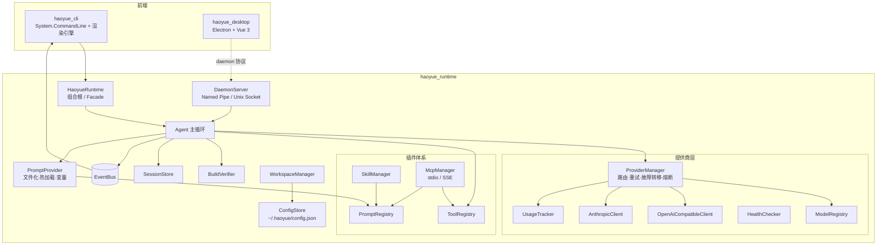

<p align="center">
  
</p>

<h1 align="center">Haoyue</h1>

<div align="center">

[](https://opensource.org/licenses/MIT)
[](https://dotnet.microsoft.com/)
[](https://www.npmjs.com/package/haoyue-cli)
[](https://github.com/Laogaodhck/haoyue/stargazers)
[](https://github.com/Laogaodhck/haoyue/network/members)
[](https://github.com/Laogaodhck/haoyue/issues)
[](https://github.com/Laogaodhck/haoyue/pulls)

**现代化、高性能的 AI Agent**

Haoyue 是基于 .NET 10.0 构建的高性能 AI Agent，采用清洁架构和事件驱动设计。它提供开箱即用的终端 CLI 与桌面应用，为构建 AI 驱动的编码助手提供完整平台，支持多 LLM 提供商、工具执行、知识库、会话管理和流畅的交互体验。

[🌐 官方网站与文档](https://github.com/Laogaodhck/haoyue) •
[English](README_EN.md) •
[快速开始](#-安装) •
[功能特性](#-功能特性)

</div>

## ✨ 功能特性

### 🚀 Runtime First 架构

- **清洁架构**：以 `haoyue_runtime` 为核心，`haoyue_cli`（终端）与 `haoyue_desktop`（桌面）作为前端，关注点分离
- **常驻守护进程**：daemon 通过 Named Pipe / Unix Socket 暴露 JSON-RPC，桌面端与 CLI 共享同一运行时
- **插件系统**：Tools、Skills、Prompts 与 MCP（Model Context Protocol）四层扩展机制
- **事件驱动**：通过事件总线实现渲染与业务逻辑解耦

### 🤖 多提供商支持

- **OpenAI 兼容**：GPT-5.5、GPT-5.5-mini 及所有 OpenAI 兼容 API
- **Anthropic**：Claude Opus、Claude Sonnet、Claude Haiku
- **Google**：Gemini Pro、Gemini Flash
- **本地模型**：Ollama、LM Studio，或直接在进程内运行 GGUF 模型（无需任何服务器）
- **智能路由**：快速、均衡、质量、经济、离线等多种策略
- **故障转移**：自动重试、指数退避和熔断器机制

### 🛠️ 工具生态系统

- **文件与执行**：文件读/写/编辑（diff 精确应用）、grep/glob 搜索、bash 执行
- **联网能力**：网页搜索（web_search）与网页抓取（web_fetch）
- **任务规划**：内置计划工具，维护任务列表并跟踪多步骤执行进度
- **屏幕捕获**：截屏工具，可将屏幕内容交给模型分析
- **MCP 支持**：stdio 和 SSE 传输，自动发现工具/提示/资源，提示与资源内容自动注入上下文（按注入 token 预算截断，读取失败自动降级）
- **技能系统**：基于目录的技能，支持提示注入与工作流；manifest v2 提供触发关键词（triggers）、工具白名单（allowed-tools）与参数收集（parameters）

### 🧠 知识库与记忆

- **自动沉淀**：Agent 在对话中自动保存、检索、遗忘知识（knowledge_save / knowledge_search / knowledge_forget）
- **高容错检索**：同义词扩展、全半角归一化、CJK 二元分词与编辑距离兜底，错别字、中英文混排、全角输入也能准确命中；支持自定义同义词表（`~/.haoyue/knowledge/synonyms.txt`，热重载，适配医疗、法律等垂直领域术语）
- **规则与记忆**：AGENTS.md 工作区规则自动注入（可开关），MEMORY.md 长期记忆支持自动/手动两种管理模式
- **可视化维护**：桌面端知识库页面支持条目增删改、文档导入与实时搜索

### 🖥️ 桌面应用

- **现代界面**：Electron + Vue 3 + TypeScript，流式 Markdown 渲染、图片预览、推理深度调节
- **专家系统**：内置领域专家库，一键切换角色预设
- **可视化配置**：Provider、模型、Profile、MCP 服务器全程图形化管理
- **任务管理**：定时任务调度与归档任务管理，任务失败即时桌面通知，并支持 Webhook 回调（桌面端离线也能收到）
- **用量统计**：Token 用量趋势与模型分布图表

### 💻 现代化终端体验

- **游戏式渲染**：30-60 FPS 刷新率，双缓冲技术
- **流式输出**：实时 token 流式传输，显示思考/推理过程
- **实时 UI**：加载动画、进度条、工具状态和 Markdown 渲染
- **增量更新**：无闪烁、无滚动、平滑动画

### 📁 工作区管理

- **项目识别**：自动识别 Git、.NET、Node.js、Python、Rust、Go、Unity、Vue 项目
- **隔离配置**：每个工作区独立的配置、缓存和内存，会话按工作区作用域隔离
- **自动初始化**：自动创建 `.haoyue/` 目录结构

### 🌐 官网与技能市场

- **双语文档**：中英文在线文档站
- **技能市场**：在线浏览、搜索与提交技能分享，桌面端可使用官方技能
- **账号体系**：注册登录与管理后台，Cookie 认证 + 速率限制

### 🔧 开发者体验

- **会话管理**：基于 SQLite 的会话持久化、恢复与并发访问，支持标题与消息正文全文搜索（按命中数与时间排序）
- **内存系统**：工作区特定的内存，自动上下文注入
- **验证机制**：代码修改后自动构建/检查/修复循环，支持多步验证命令链（按序执行、fail-fast，失败步骤的错误行摘要直接进入修复提示）
- **热重载**：提示文件和配置无需重启即可重载

## 📦 安装

### 通过 npm 安装 CLI（推荐）

已发布到 npm 的 `haoyue-cli` 是自包含 .NET 二进制包，安装后可直接使用，无需单独安装 .NET SDK。当前 npm 包提供 Windows x64 平台二进制。

前置要求：

- Node.js 18 或更高版本
- Git（用于工作区检测）

```powershell
npm install -g haoyue-cli

# 验证安装
haoyue --version

# 进入交互式聊天
haoyue
```

也可以执行单次任务或管理命令：

```powershell
haoyue "解释这个项目的架构"
haoyue --continue
haoyue doctor
```

### 从源码构建

开发者从源码构建时需要：

- .NET 10.0 SDK 或更高版本
- Git（用于工作区检测）

```bash
git clone https://github.com/Laogaodhck/haoyue.git
cd haoyue
dotnet build
```

### 从源码运行

```bash
# 交互式聊天模式
dotnet run --project haoyue_cli

# 单次提示
dotnet run --project haoyue_cli -- "解释这个项目的架构"

# 继续上一个会话
dotnet run --project haoyue_cli -- --continue

# 恢复特定会话
dotnet run --project haoyue_cli -- --resume <session-id>

# 覆盖模型
dotnet run --project haoyue_cli -- --model "openai/gpt-5.5"
```

## 🏗️ 架构设计



## 📁 项目结构

```
Haoyue/
├── haoyue_cli/           # CLI 前端
│   ├── Commands/           # CLI 命令（provider、model、profile 等）
│   ├── Ui/                 # 终端渲染引擎
│   └── Program.cs          # 入口点
├── haoyue_runtime/       # 核心运行时
│   ├── Agents/             # Agent 循环和上下文规划
│   ├── ComputerUse/        # 屏幕捕获
│   ├── Configuration/      # 配置管理
│   ├── Daemon/             # 守护进程（Named Pipe / Unix Socket JSON-RPC）
│   ├── Data/               # 数据层（知识库存储、导入与检索排序）
│   ├── Events/             # 事件总线系统
│   ├── Experts/            # 专家系统
│   ├── Mcp/                # MCP 客户端实现
│   ├── Prompts/            # 提示加载和组合
│   ├── Providers/          # LLM 提供商集成
│   ├── Scheduling/         # 定时任务
│   ├── Sessions/           # 会话持久化
│   ├── Skills/             # 技能管理
│   ├── Tools/              # 工具注册和实现
│   ├── Verification/       # 构建验证
│   └── Workspaces/         # 工作区检测和管理
├── haoyue_desktop/       # 桌面应用（Electron + Vue 3 + TypeScript）
├── haoyue_webserver/     # 官网与技能市场（Blazor Server + SQLite）
├── haoyue_website/       # 文档站源码（VitePress）
├── haoyue_tests/         # 运行时单元测试
├── haoyue_cli_tests/     # CLI 测试
├── models/               # 本地 GGUF 模型（开发环境）
└── packaging/            # 打包脚本与配置
```

## ⚙️ 配置

### 全局配置

位于 `~/.haoyue/config.json`：

```json
{
  "providers": {
    "openai": {
      "apiKey": "sk-...",
      "baseUrl": "https://api.openai.com/v1"
    },
    "anthropic": {
      "apiKey": "sk-ant-..."
    }
  },
  "profiles": {
    "default": {
      "provider": "openai",
      "model": "gpt-5.5"
    }
  },
  "agent": {
    "maxSteps": 10,
    "maxRepairAttempts": 3,
    "autoVerify": true
  }
}
```

### 工作区配置

每个项目可以在 `.haoyue/config.json` 中覆盖：

- 提供商和模型选择
- 温度和上下文设置
- 工具权限
- 技能配置
- MCP 服务器设置

## 🎯 使用示例

### 交互式聊天

```bash
haoyue chat
# 或直接
haoyue
```

### 单次任务

```bash
haoyue "将认证模块重构为使用 JWT"
haoyue "为 UserService 类编写单元测试"
haoyue "修复项目中的构建错误"
```

### 提供商管理

```bash
haoyue provider list
haoyue provider add openai --api-key sk-...
haoyue provider test openai
haoyue provider use anthropic
```

### 本地模型（GGUF）

把 GGUF 文件放入 `~/.haoyue/models`（仓库开发环境为 `models/` 目录），即可在无网络、无任何服务器的情况下进程内运行：

```bash
haoyue provider add --id local --kind local --model DeepSeek-R1-0528-Qwen3-8B-Q4_K_M.gguf
```

也可用 `--models-directory` 指定其它模型目录。本地模型支持流式输出与思考过程展示，暂不支持工具调用。

本地推理性能调优（`~/.haoyue/config.json` 的 provider 配置项）：

```json
{
  "providers": {
    "local": {
      "kind": "local",
      "modelsDirectory": "~/.haoyue/models",
      "gpuLayers": 0,
      "threads": 8,
      "localPrefixReuse": true
    }
  }
}
```

- `gpuLayers`：卸载到 GPU 的层数（llama.cpp `n_gpu_layers`）。默认 `0`（纯 CPU）。需要 GPU 时安装 CUDA 后端（如 `LLamaSharp.Backend.Cuda12`）后设为 `999` 卸载全部层；无 GPU 后端时该值被忽略。
- `threads`：CPU 推理线程数。默认由 llama.cpp 自动选择（全部逻辑核心）。
- `localPrefixReuse`：跨请求复用已解码的 KV 前缀。Agent 多步回合中，每步只解码新增的后缀 token，跳过对系统提示与历史记录的重复 prefill 计算，多步任务吞吐显著提升。前缀不匹配或后端不支持内存移动时自动回退为全量重算，结果不变。

### 模型管理

```bash
haoyue model list
haoyue model use openai/gpt-5.5
haoyue model info claude-opus
haoyue model search "快速编码模型"
```

### 会话管理

```bash
haoyue session list
haoyue session resume <session-id>
haoyue session export <session-id> --format json
```

会话数据和 Desktop 项目列表统一保存在 `~/.haoyue/haoyue.db`。升级后首次访问工作区时，旧的 `.session/*.jsonl`、`.haoyue/sessions/*.jsonl` 或全局 `~/.haoyue/sessions/*.jsonl` 会自动导入，原文件保留为备份。Provider、模型、Profile、MCP、Skill、工作区配置仍使用原有 JSON/文本文件，用量记录仍为 `~/.haoyue/usage.jsonl`。

### 知识库与数据管理

CLI 内置知识库、工作区规则、记忆、专家与定时任务的管理命令：

```bash
# 知识库：检索、沉淀与维护（内容可经管道输入）
haoyue knowledge search "部署流程"
haoyue knowledge add "发布步骤" --tags 运维,发布
haoyue knowledge list

# 工作区规则（AGENTS.md 层级发现与编辑）
haoyue rules list
haoyue rules set

# 长期记忆（--global 操作全局记忆）
haoyue memory show
haoyue memory set "本仓库发布前必须跑全量测试"

# 内置专家目录
haoyue expert list

# 定时任务（8 位短 id 前缀即可定位任务）
haoyue schedule add "日报" "0 9 * * *" "汇总昨日提交生成日报"
haoyue schedule list
haoyue schedule enable <id>
```

### 健康检查

```bash
haoyue doctor
```

## 🔌 扩展 Haoyue

### 添加工具

实现 `ITool` 接口：

```csharp
public class MyTool : ITool
{
    public string Name => "my_tool";
    public string Description => "执行有用的操作";
    public JsonElement ParameterSchema => /* JSON schema */;
    public bool Mutating => false;
    public string StatusLabel => "正在运行我的工具";
    
    public async Task<ToolResult> ExecuteAsync(
        JsonObject args, ToolContext ctx, CancellationToken ct)
    {
        // 实现
    }
}
```

### 创建技能

在 `skills/` 目录中创建：

```
skills/
  my-skill/
    skill.yaml          # 元数据和配置
    prompt.txt          # 提示模板
    tools/              # 可选的工具实现
```

`skill.yaml` 支持可选的 v2 字段控制注入行为：

```yaml
name: my-skill
description: 一句话描述这个技能什么时候用
triggers:            # 声明后仅当用户消息命中关键词才注入；不声明则常驻
  - 部署
  - 发布
allowed-tools:       # 注入期间可用的工具白名单；不声明则不限制
  - bash
  - read_file
parameters:          # 注入提示末尾追加参数收集说明
  - name: env
    description: 目标部署环境
    required: true
```

### MCP 服务器

在 `mcp/servers.json` 中配置：

```json
{
  "servers": {
    "my-server": {
      "command": "node",
      "args": ["path/to/server.js"],
      "transport": "stdio"
    }
  }
}
```

服务器暴露的提示（prompts）与文本资源（resources）会自动注册为系统提示的上下文贡献：内容按注入 token 预算截断后进入提示词，每个服务器最多注入 16 个资源，读取失败自动降级，不影响正常会话。

## 🧪 测试

```bash
# 运行所有测试
dotnet test haoyue_tests

# 运行特定测试类
dotnet test haoyue_tests --filter "ClassName=ProviderTests"
```

## 📊 监控

Haoyue 包含内置监控：

- **使用统计**：Token 计数、成本、响应时间
- **健康检查**：提供商可用性和延迟
- **熔断器**：自动故障检测和恢复
- **会话分析**：对话历史和模式

## 📄 许可证

本项目采用 MIT 许可证 - 查看 [LICENSE](LICENSE) 文件了解详情。

## 🙏 致谢

- 使用 .NET 10.0 和 System.CommandLine 构建
- 使用 Spectre.Console 进行终端渲染
- 遵循清洁架构和垂直切片模式
- 采用 Native AOT 友好的设计理念

## 👤 作者

**老高** · QQ：846193

---

**Haoyue** - 基于现代化 .NET 的高性能 AI Agent。
