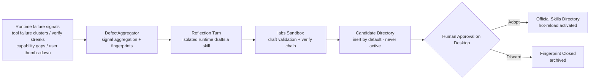
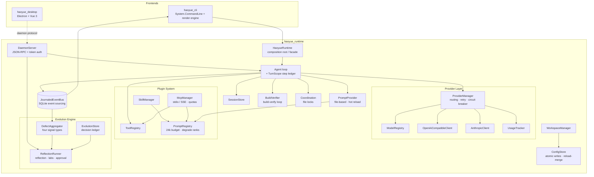

<p align="center">
  
</p>

<h1 align="center">Haoyue</h1>

<div align="center">

[](https://opensource.org/licenses/MIT)
[](https://dotnet.microsoft.com/)
[](https://www.npmjs.com/package/haoyue-cli)
[](https://github.com/Laogaodhck/haoyue/stargazers)
[](https://github.com/Laogaodhck/haoyue/network/members)
[](https://github.com/Laogaodhck/haoyue/issues)

**A self-reflecting, local-first AI Agent platform**

Haoyue is a high-performance AI agent built on .NET 10, centered on an event-sourced runtime with terminal CLI and desktop app frontends. Beyond full agent capabilities (multi-provider LLMs, tool execution, skills, MCP, knowledge base), Haoyue ships an uncommon **meta-cognitive layer**: it aggregates failure signals automatically, drives reflection turns that produce skill drafts, and activates them through human approval — the agent keeps getting better as you use it.

[Quick Start](#-quick-start) •
[Features](#-features) •
[Architecture](#️-architecture) •
[Evolution Engine](#-evolution-engine) •
[中文](README.md)

</div>

---

## ✨ Features

### 🏗️ Runtime First Architecture

- **Clean Architecture**: `haoyue_runtime` is the core; CLI and desktop are two of its frontends, with strict separation of concerns
- **Resident Daemon**: the daemon exposes JSON-RPC over Named Pipe / Unix Socket; the desktop app and CLI share the same runtime, HTTP connection pool, circuit breaker, and file-lock coordinator
- **Secure Access**: a random handshake token is generated at startup (`~/.haoyue/daemon.token`, readable only by the current user); clients must present the token as their first message or the connection is rejected immediately
- **Event Sourcing**: key events (turns, tool calls, usage, diagnostics, evolution signals) are persisted to a SQLite event log (last 5,000 entries); `events.recent` replays them — nothing is lost across restarts
- **Four-Layer Extensions**: Tools, Skills, Prompts, and MCP (Model Context Protocol)

### 🤖 Multi-Provider & Models

- **OpenAI-compatible / Anthropic / Google**: mainstream cloud models out of the box
- **Local Models**: Ollama, LM Studio, or GGUF models running in-process directly (no server required), with GPU layer offload, KV cache quantization, Flash Attention, and cross-request KV prefix reuse
- **Smart Routing**: fast, balanced, quality, budget, and offline strategies; automatic retry with exponential backoff and circuit-breaker failover
- **Usage Analytics**: token counts, cost, and model distribution with desktop charts

### 🛠️ Tool & Skill Ecosystem

- **Built-in Tools**: file read/write/edit (precise diff application), grep/glob, bash, web search & fetch, task planning, screen capture
- **MCP**: stdio and SSE transports with automatic discovery of tools/prompts/resources; prompt injection is capped at 24 per server and 48 total, with the truncation reason visible in MCP status
- **Skill System**: directory-based skills (`skill.yaml` + `prompt.txt`); manifest v2 supports trigger keywords, tool whitelists, and parameter collection; skills hot-reload on change, no restart needed

### 🧠 Knowledge Base & Memory

- **Automatic Capture**: knowledge is saved / searched / forgotten automatically during conversations
- **Fault-Tolerant Retrieval**: synonym expansion, full/half-width normalization, CJK bigram tokenization, and edit-distance fallback — typos and mixed Chinese/English queries still hit; custom synonym lists hot-reload
- **Rules & Memory**: AGENTS.md workspace rules injected automatically (with a provenance envelope and pinned priority), MEMORY.md long-term memory with automatic / manual management

### 🔒 Reliability & Safety (under the meta layer)

- **Atomic Writes**: config and state writes go through a same-directory temp file + atomic swap — a crash never leaves a half-written file; field-level reload-merge before each save keeps concurrent multi-client edits to their own changes
- **Single-Writer Convergence**: CLI config writes are delegated to the online daemon (`config.save`) and only fall back to local writes when offline — multi-writer races are eliminated
- **Prompt Budget**: when injected context exceeds a 24k token total budget, contributions are dropped in inverse degrade-rank order (knowledge → skill bodies → MCP → catalogs/memory) while System/Developer messages are never dropped; every drop is announced in the session
- **Turn Rollback (TurnScope)**: each turn keeps a step ledger and a compensation stack, so `write`/`edit` file changes can be reverted in one click (`agent.undo`); the desktop shows an undo banner after each turn; on daemon crash, startup reconciliation surfaces the restorable files of unfinished turns

### 🖥️ Desktop App

- **Modern UI**: Electron + Vue 3 + TypeScript, streaming Markdown, image preview, reasoning depth control
- **Expert System**: built-in domain expert catalog with one-click role presets
- **Visual Configuration**: providers, models, profiles, MCP servers, and local inference acceleration — all GUI-managed
- **Scheduled Tasks**: cron-driven scheduling turns with instant desktop notifications on failure and Webhook callbacks
- **Turn Undo & Feedback**: one-click revert of file changes; thumbs-down any assistant answer with a reason — the feedback feeds straight into the evolution signals

### 💻 Modern Terminal Experience

- **Game-Style Rendering**: 30-60 FPS double buffering, streaming output, reasoning display, tool status, and live Markdown rendering with flicker-free incremental updates

### 📁 Workspace Management

- **Project Detection**: automatic recognition of Git, .NET, Node.js, Python, Rust, Go, Unity, and Vue projects
- **Isolated Configuration**: per-workspace config, cache, sessions, and memory
- **Templated Init**: `haoyue init` generates AGENTS.md and config structure; templates are globally customizable and existing files are never overwritten

## 🚀 Quick Start

### Install CLI via npm (Recommended)

Self-contained .NET binaries — no separate .NET SDK required. Windows x64 is currently provided.

Prerequisites: Node.js 18+, Git.

```powershell
npm install -g haoyue-cli

haoyue --version
haoyue              # interactive chat
haoyue "Explain this project's architecture"
haoyue doctor       # health check
```

### Build from Source

Requires .NET 10 SDK and Git:

```bash
git clone https://github.com/Laogaodhck/haoyue.git
cd haoyue
dotnet build

dotnet run --project haoyue_cli              # interactive chat
dotnet run --project haoyue_cli -- --continue  # continue the last session
dotnet run --project haoyue_cli -- --model "openai/gpt-5.5"
```

Desktop app: enter `haoyue_desktop` and run `pnpm install && pnpm dev`.

## ⚡ Evolution Engine

Haoyue's meta-cognitive layer keeps improving the agent through usage — with **zero code changes and human final approval** throughout:



- **Four signal types**: the same (tool, error) failing ≥3 times within 30 minutes; a verify chain failing ≥3 times in a row (including a barely-passing recovery); a `declare_skill` capability gap (reported on a single occurrence); user thumbs-down feedback (each one becomes its own report)
- **Reflection turn**: triggered by cron or manually, it analyzes defect reports in an isolated runtime and produces `new-skill` / `revise-skill` conclusions
- **labs sandbox**: drafts must be written under `~/.haoyue/labs/`; after validation they are promoted to `~/.haoyue/skills-candidates/` — a directory outside the skill scan roots, **inert by nature**, never effective until approved
- **Anti-self-feeding**: a defect fingerprint is processed only once (decision-ledger idempotency); the reflection turn's own events are excluded by the aggregator — reflection never reflects on its own reflections
- **Safety red line**: the LLM may only produce skill-layer data assets (`skill.yaml` / `prompt.txt`); modifying runtime code or core prompts is forbidden — code evolution follows the human process

Related RPCs: `evolution.inspect` (view defect reports), `evolution.reflect` (trigger reflection), `evolution.pending-list` / `evolution.decide` (approval), `feedback.turn` (negative feedback).

## 🏗️ Architecture



## 📁 Project Structure

```
Haoyue/
├── haoyue_cli/           # CLI frontend
│   ├── Commands/           # CLI commands (provider, model, knowledge, schedule, etc.)
│   ├── Ui/                 # Terminal render engine
│   └── Program.cs          # Entry point
├── haoyue_runtime/       # Core runtime
│   ├── Agents/             # Agent loop, context planning, TurnScope rollback
│   ├── ComputerUse/        # Screen capture
│   ├── Configuration/      # Config management (atomic writes, reload-merge, single-writer bridge)
│   ├── Coordination/       # File-lock coordinator
│   ├── Daemon/             # Daemon (JSON-RPC, RPC routing, crash reconciliation)
│   ├── Data/               # Data layer (knowledge storage, retrieval ranking, SQLite)
│   ├── Events/             # Event bus & journal (SQLite persistence)
│   ├── Evolution/          # Evolution engine (signal aggregation, decision ledger, reflection turns)
│   ├── Experts/            # Expert system
│   ├── Mcp/                # MCP client (stdio/SSE, injection quotas)
│   ├── Prompts/            # Prompt loading, composition, and budget enforcement
│   ├── Providers/          # LLM provider integrations & circuit breaker
│   ├── Scheduling/         # Scheduled task dispatch
│   ├── Sessions/           # Session persistence (SQLite)
│   ├── Skills/             # Skill management (manifest v2, hot reload)
│   ├── Tools/              # Tool registry and implementations
│   ├── Verification/       # Build verification chain
│   └── Workspaces/         # Workspace detection and management
├── haoyue_desktop/       # Desktop app (Electron + Vue 3 + TypeScript)
├── haoyue_webserver/     # Skill marketplace (Blazor Server + SQLite)
├── haoyue_website/       # Docs site source (VitePress)
├── haoyue_tests/         # Runtime unit tests (399 cases)
├── haoyue_cli_tests/     # CLI tests
├── haoyue_doc/           # Design & review documents (see haoyue_doc/README.md index)
├── models/               # Local GGUF models (dev environment)
└── packaging/            # Packaging scripts and configuration
```

## ⚙️ Configuration

### Global Configuration

Lives at `~/.haoyue/config.json` (all writes are atomic; concurrent multi-client edits merge only changed fields):

```json
{
  "providers": {
    "openai": { "apiKey": "sk-...", "baseUrl": "https://api.openai.com/v1" }
  },
  "profiles": {
    "default": { "provider": "openai", "model": "gpt-5.5" }
  },
  "agent": {
    "maxSteps": 10,
    "maxRepairAttempts": 3,
    "autoVerify": true
  }
}
```

### Workspace Configuration

Each project can override providers and models, temperature and context, tool permissions, skill and MCP server settings in `.haoyue/config.json`.

### Local Model Tuning

```json
{
  "providers": {
    "local": {
      "kind": "local",
      "modelsDirectory": "~/.haoyue/models",
      "gpuLayers": 0,
      "threads": 8,
      "localPrefixReuse": true,
      "flashAttention": false,
      "kvCacheQuantization": "none"
    }
  }
}
```

- `gpuLayers`: number of GPU-offloaded layers, default `0` (pure CPU); set `999` after installing a CUDA backend to offload everything
- `localPrefixReuse`: reuse KV prefixes across requests — multi-step turns only decode new tokens, throughput improves significantly
- `flashAttention` / `kvCacheQuantization`: attention-kernel acceleration and KV cache quantization (`q8_0` / `q4_0`); quantization only takes effect with Flash Attention enabled

All of these can also be configured visually in the desktop app under "Settings → Advanced → Local Inference Acceleration".

## 🎯 Usage Examples

```bash
# Sessions & providers
haoyue session list && haoyue session resume <session-id>
haoyue provider add openai --api-key sk-...
haoyue model use openai/gpt-5.5

# Knowledge base & memory
haoyue knowledge search "deployment process"
haoyue knowledge add "Release steps" --tags ops,release
haoyue memory set "Run the full test suite before releasing this repo"

# Scheduled tasks (cron drives full agent turns)
haoyue schedule add "Daily report" "0 9 * * *" "Summarize yesterday's commits into a report"
```

Session data is stored in `~/.haoyue/haoyue.db`; legacy session formats are imported automatically on upgrade.

## 🔌 Extending Haoyue

### Adding a Tool

Implement the `ITool` interface and register it with the ToolRegistry:

```csharp
public class MyTool : ITool
{
    public string Name => "my_tool";
    public string Description => "Does something useful";
    public JsonElement ParameterSchema => /* JSON schema */;
    public bool Mutating => false;
    public string StatusLabel => "Running my tool";

    public async Task<ToolResult> ExecuteAsync(
        JsonObject args, ToolContext ctx, CancellationToken ct)
    {
        // implementation
    }
}
```

### Creating a Skill

```
skills/
  my-skill/
    skill.yaml          # metadata and configuration
    prompt.txt          # prompt template
```

`skill.yaml` supports optional v2 fields controlling injection behavior:

```yaml
name: my-skill
description: One sentence on when to use this skill
triggers:            # once declared, injected only when a user message hits a keyword; otherwise always on
  - deploy
allowed-tools:       # tool whitelist during injection; unrestricted if omitted
  - bash
parameters:          # appends a parameter-collection note to the prompt
  - name: env
    description: Target deployment environment
    required: true
```

### MCP Servers

Configure stdio or SSE servers in `mcp/servers.json`; their prompts and resources are registered automatically as context contributions, injected under the 24k total budget with up to 24 prompts per server and 48 globally — truncation reasons are visible in MCP status.

## 🧪 Testing

```bash
dotnet test haoyue_tests      # runtime tests (399 cases)
dotnet test haoyue_cli_tests  # CLI tests

# Desktop (requires pnpm install first)
cd haoyue_desktop && pnpm test && pnpm typecheck
```

## 📚 Design Documents

Architecture reviews, adjudications, and implementation plans are collected in [`haoyue_doc/`](haoyue_doc/README.md) (in Chinese), including:

- State concurrency, context boundaries, and atomicity risk review (with fix reconciliation)
- Workflow orchestration adjudication & TurnScope design
- Evolution engine blueprint review & landing design (E1-E4)
- NLP & HCI optimization assessment, knowledge base optimization notes
- ProviderManager concurrency and parameter review

## 📄 License

This project is licensed under the MIT License - see the [LICENSE](LICENSE) file for details.

## 👤 Author

**Laogao (老高)** · QQ: 846193

---

**Haoyue** - A self-reflecting, local-first AI Agent platform.
