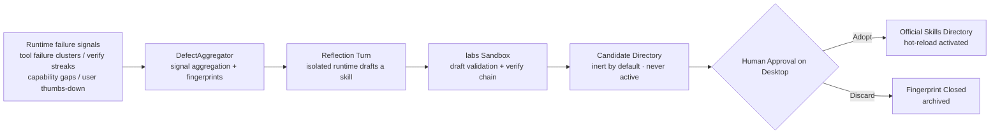
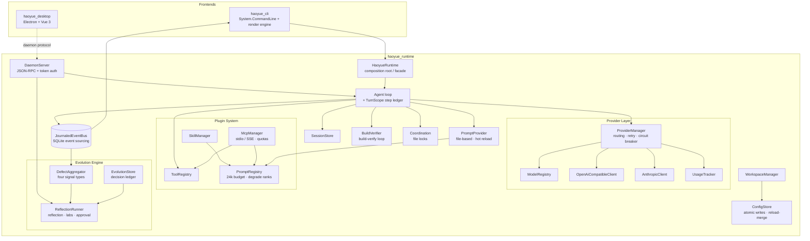

<p align="center">
  
</p>

<h1 align="center">Haoyue</h1>

<div align="center">

[](https://opensource.org/licenses/MIT)
[](https://dotnet.microsoft.com/)
[](https://www.npmjs.com/package/haoyue-cli)
[](https://github.com/Laogaodhck/haoyue/stargazers)
[](https://github.com/Laogaodhck/haoyue/network/members)
[](https://github.com/Laogaodhck/haoyue/issues)

**A self-reflecting, local-first AI Agent platform**

Haoyue is a high-performance AI agent built on .NET 10, centered on an event-sourced runtime with terminal CLI and desktop app frontends. Beyond full agent capabilities (multi-provider LLMs, tool execution, skills, MCP, knowledge base), Haoyue ships an uncommon **meta-cognitive layer**: it aggregates failure signals automatically, drives reflection turns that produce skill drafts, and activates them through human approval — the agent keeps getting better as you use it.

[Quick Start](#-quick-start) •
[Features](#-features) •
[Architecture](#️-architecture) •
[Evolution Engine](#-evolution-engine) •
[中文](README.md)

</div>

---

## ✨ Features

### 🏗️ Runtime First Architecture

- **Clean Architecture**: `haoyue_runtime` is the core; CLI and desktop are two of its frontends, with strict separation of concerns
- **Resident Daemon**: the daemon exposes JSON-RPC over Named Pipe / Unix Socket; the desktop app and CLI share the same runtime, HTTP connection pool, circuit breaker, and file-lock coordinator
- **Secure Access**: a random handshake token is generated at startup (`~/.haoyue/daemon.token`, readable only by the current user); clients must present the token as their first message or the connection is rejected immediately
- **Event Sourcing**: key events (turns, tool calls, usage, diagnostics, evolution signals) are persisted to a SQLite event log (last 5,000 entries); `events.recent` replays them — nothing is lost across restarts
- **Four-Layer Extensions**: Tools, Skills, Prompts, and MCP (Model Context Protocol)

### 🤖 Multi-Provider & Models

- **OpenAI-compatible / Anthropic / Google**: mainstream cloud models out of the box
- **Local Models**: Ollama, LM Studio, or GGUF models running in-process directly (no server required), with GPU layer offload, KV cache quantization, Flash Attention, and cross-request KV prefix reuse; load failures retry automatically (falling back to CPU when GPU offload fails), and every successful load runs a small-context inference self-check — corrupted weights or an unallocatable context surface at load time rather than mid-conversation; the CUDA 12 backend delivers a measured **11× decoding speedup** (7.6 → 84.9 tok/s)
- **Local Multimodal Vision**: companion mmproj weights are auto-discovered so local models can directly "see" images in conversations and tool screenshots — image-bearing requests automatically fall back to a CPU context to dodge an upstream CUDA slow path, while text-only turns stay at full GPU speed
- **Smart Routing**: fast, balanced, quality, budget, and offline strategies; automatic retry with exponential backoff and circuit-breaker failover
- **Usage Analytics**: token counts, cost, and model distribution with desktop charts

### 🛠️ Tool & Skill Ecosystem

- **Built-in Tools**: file read/write/edit (precise diff application), grep/glob, bash, web search & fetch, task planning, screen capture
- **MCP**: stdio and SSE transports with automatic discovery of tools/prompts/resources; prompt injection is capped at 24 per server and 48 total, with the truncation reason visible in MCP status
- **Skill System**: directory-based skills (`skill.yaml` + `prompt.txt`); manifest v2 supports trigger keywords, tool whitelists, and parameter collection; skills hot-reload on change, no restart needed
- **Multimodal Output**: `image_generate` image generation (OpenAI-compatible images/generations endpoint, b64/url channels); artifacts land in `.haoyue/outputs/images/` and can be fed back into the visual verification chain; the tool hides itself automatically when no image model is configured (local diffusion models are outside in-process inference scope — plug in a ComfyUI/SD-compatible gateway instead, see the [Deployment & Isolation Runbook](haoyue_doc/runbooks/deployment-isolation.md))
- **Allowed websites (external-access allowlist)**: once `web.allowedSites` is configured, `web_fetch` can only reach listed origins plus localhost (127.x / ::1 always allowed); `https://*.example.com` allows subdomains while the apex example.com must be added separately; enforced at runtime and re-read per call, managed visually in the desktop "设置 → 允许的网站" card (RPC `web.allowedGet` / `web.allowedSet`) — changes take effect immediately, no restart needed

### 🧠 Knowledge Base & Memory

- **Automatic Capture**: knowledge is saved / searched / forgotten automatically during conversations
- **Fault-Tolerant Retrieval**: synonym expansion, full/half-width normalization, CJK bigram tokenization, and edit-distance fallback — typos and mixed Chinese/English queries still hit; custom synonym lists hot-reload
- **Semantic Retrieval Layer**: once an embedding-capable model is configured, knowledge retrieval upgrades to hybrid "lexical + cosine similarity" ranking (0.6/0.4 fusion), with vectors cached per (workspace, term, model) in SQLite; any failure falls back to pure lexical retrieval as a whole — semantics is an enhancement, not a dependency. Two on-ramps: HTTP via OpenAI-compatible /embeddings (Ollama / LM Studio / cloud), or local GGUF embedding models (`capabilities.embedding = true`) running in-process with zero network dependency
- **Rules & Memory**: AGENTS.md workspace rules injected automatically (with a provenance envelope and pinned priority), MEMORY.md long-term memory with automatic / manual management
- **Project Facts Layer**: `fact_save` captures structured one-line facts with source, confidence, and optional TTL (`.haoyue/facts.json`), auto-injected into later turns tagged "to be confirmed", expiring automatically — an intermediate memory layer between MEMORY.md and the knowledge base

### 🤝 Multi-Agent Collaboration

- **Single-Task Delegation**: `delegate_task` runs a sub-agent in an isolated context and session; nesting depth is controlled by `agent.delegationMaxDepth` (default 1, cap 4)
- **Parallel Fan-Out**: `delegate_tasks` dispatches 2-6 independent subtasks to parallel sub-agents and returns one aggregated report organized by task; parallel sub-agents coordinate file writes through the shared file-lock coordinator and may not delegate further

### 🔒 Reliability & Safety (under the meta layer)

- **Mandatory Tool Execution Policy Gate**: every tool call is evaluated by `ToolExecutionPolicy` after argument parsing and before execution (the model cannot bypass it) — user allow/deny regex rules plus built-in bash high-risk guards (recursive root deletion, disk wipe, fork bombs, curl|sh remote execution, shadow-copy deletion, etc.); a hit is rejected and journaled as an audit event; configured via `agent.toolPolicy`
- **Bash Command Audit**: every executed command is pre-classified by content risk (low/medium/high, with rationale) and fully recorded (command, directory, risk, result, duration) appended to `.haoyue/audit/bash.jsonl` in the workspace — never rotated or truncated, always traceable
- **Process-Level Sandbox (Windows Job Object)**: with `agent.bashSandbox.enabled`, the entire bash child process tree enters a kernel-enforced fence — memory cap (default 2GB/process), active process cap (default 256), UI restrictions (clipboard/system parameters/display settings/shutdown/desktop switch), and kill-on-close so timed-out commands leave no orphans; network isolation is beyond Job Object's reach, and audit records carry a sandbox flag — the network plane is closed at the deployment layer; see the [Deployment & Isolation Runbook](haoyue_doc/runbooks/deployment-isolation.md) (egress allowlist proxy / per-program firewall blocking / containerization); self-supplied GGUF (including embedding model registration) is covered in section 3 of the same runbook

- **Atomic Writes**: config and state writes go through a same-directory temp file + atomic swap — a crash never leaves a half-written file; field-level reload-merge before each save keeps concurrent multi-client edits to their own changes
- **Single-Writer Convergence**: CLI config writes are delegated to the online daemon (`config.save`) and only fall back to local writes when offline — multi-writer races are eliminated
- **Prompt Budget**: when injected context exceeds a 24k token total budget, contributions are dropped in inverse degrade-rank order (knowledge → skill bodies → MCP → catalogs/memory) while System/Developer messages are never dropped; every drop is announced in the session
- **Turn Rollback (TurnScope)**: each turn keeps a step ledger and a compensation stack, so `write`/`edit` file changes can be reverted in one click (`agent.undo`); the desktop shows an undo banner after each turn; on daemon crash, startup reconciliation surfaces the restorable files of unfinished turns

### 📋 Background Task Queue

- **Long tasks in the background**: the daemon RPC `task.start` submits a full agent turn for background execution (concurrency cap 4, hard timeout protection); `task.get` / `task.list` / `task.cancel` manage tasks; terminal states broadcast via `task.updated`, sessions persist, and progress replays through `events.recent` — frontend disconnects never lose progress

### 🖱️ Computer Use

- **Full observe → act → verify loop**: the `computer` tool supports 18 actions (mouse move/click/drag, keyboard input, window management, scrolling, etc.), with an automatic screenshot sent back to the model after each step to verify the result
- **Cloud and local models can both "see the screen"**: cloud vision models parse screenshots directly; local GGUF models read them through the mmproj multimodal integration — no more navigating blind via accessibility text only
- **Coordinate self-calibration**: CoordinateMapper screen calibration + `cursor_position` self-check, DriverFaultSandbox driver fault tolerance, and a 30-step-per-turn cap as a safety net
- **System Control subsystem**: `computer_exec` (cross-platform shell resolution — `auto` picks PowerShell/bash by OS, `cmd` is Windows-only, `bash` POSIX-only, powershell on POSIX requires pwsh; Python detection shares one source with sysinfo: configured path → PATH → py launcher/common install dirs, with a cached version probe) + `computer_scan` (hardware device and folder-structure scanning to locate follow-up actions) + `computer_sysinfo` (system configuration, settings, and running processes, including a platform line, shell environment, and the Python version report) + `computer_browser_repair` (browser homepage hijack detection & repair — covers policy registry, IE start page, Preferences JSON, Firefox prefs.js, and hijacked shortcuts; repairs always back up findings first and can be rolled back)
- **OS auto-detection & precise command dialects**: the runtime classifies Windows / Linux / macOS itself so the model never guesses — `computer_exec` rejects unsupported kinds with a precise message naming the OS and the correct kind, timeout tree-kill picks taskkill /T vs entireProcessTree kill per platform; `computer_sysinfo` reports platform and Python version up front so follow-up commands are written in the right dialect immediately
- **Cross-platform adaptation**: system control picks the Windows / Linux adapter automatically (CIM queries & registry repair vs. /proc, lscpu, /etc policy files); permission-denied operations are reported per-item with elevation hints instead of failing the whole call
- **Dormant by default**: `computerUse.enabled` defaults to off; enabling it requires an explicit toggle in desktop settings, accompanied by a full-screen halo indicator; `systemControlEnabled` turns off system control alone without affecting mouse/keyboard operation

### 🖥️ Desktop App

- **Modern UI**: Electron + Vue 3 + TypeScript, streaming Markdown, image preview, reasoning depth control
- **Expert System**: built-in domain expert catalog with one-click role presets
- **Visual Configuration**: providers, models, profiles, MCP servers, and local inference acceleration — all GUI-managed; the "Models & Providers" page shows the active model's parameters (context window / max output), capability badges (streaming / tools / thinking / vision / reasoning), and the full model catalog; local models gain a "Load Settings" page — six sections (context & performance, generation, thinking, memory, speculative decoding, advanced) with view/edit/save wired into the load pipeline
- **Scheduled Tasks**: cron-driven scheduling turns with instant desktop notifications on failure and Webhook callbacks
- **Turn Undo & Feedback**: one-click revert of file changes; thumbs-down any assistant answer with a reason — the feedback feeds straight into the evolution signals

### 💻 Modern Terminal Experience

- **Game-Style Rendering**: 30-60 FPS double buffering, streaming output, reasoning display, tool status, and live Markdown rendering with flicker-free incremental updates

### 📁 Workspace Management

- **Project Detection**: automatic recognition of Git, .NET, Node.js, Python, Rust, Go, Unity, and Vue projects
- **Isolated Configuration**: per-workspace config, cache, sessions, and memory
- **Templated Init**: `haoyue init` generates AGENTS.md and config structure; templates are globally customizable and existing files are never overwritten

## 🚀 Quick Start

### Install CLI via npm (Recommended)

Self-contained .NET binaries — no separate .NET SDK required. Windows x64 is currently provided.

Prerequisites: Node.js 18+, Git.

```powershell
npm install -g haoyue-cli

haoyue --version
haoyue              # interactive chat
haoyue "Explain this project's architecture"
haoyue doctor       # health check
```

### Build from Source

Requires .NET 10 SDK and Git:

```bash
git clone https://github.com/Laogaodhck/haoyue.git
cd haoyue
dotnet build

dotnet run --project haoyue_cli              # interactive chat
dotnet run --project haoyue_cli -- --continue  # continue the last session
dotnet run --project haoyue_cli -- --model "openai/gpt-5.5"
```

Desktop app: enter `haoyue_desktop` and run `pnpm install && pnpm dev`.

## ⚡ Evolution Engine

Haoyue's meta-cognitive layer keeps improving the agent through usage — with **zero code changes and human final approval** throughout:



- **Four signal types**: the same (tool, error) failing ≥3 times within 30 minutes; a verify chain failing ≥3 times in a row (including a barely-passing recovery); a `declare_skill` capability gap (reported on a single occurrence); user thumbs-down feedback (each one becomes its own report)
- **Reflection turn**: triggered by cron or manually, it analyzes defect reports in an isolated runtime and produces `new-skill` / `revise-skill` conclusions
- **labs sandbox**: drafts must be written under `~/.haoyue/labs/`; after validation they are promoted to `~/.haoyue/skills-candidates/` — a directory outside the skill scan roots, **inert by nature**, never effective until approved
- **Anti-self-feeding**: a defect fingerprint is processed only once (decision-ledger idempotency); the reflection turn's own events are excluded by the aggregator — reflection never reflects on its own reflections
- **Safety red line**: the LLM may only produce skill-layer data assets (`skill.yaml` / `prompt.txt`); modifying runtime code or core prompts is forbidden — code evolution follows the human process

Related RPCs: `evolution.inspect` (view defect reports), `evolution.reflect` (trigger reflection), `evolution.pending-list` / `evolution.decide` (approval), `feedback.turn` (negative feedback).

## 🏗️ Architecture



## 📁 Project Structure

```
Haoyue/
├── haoyue_cli/           # CLI frontend
│   ├── Commands/           # CLI commands (provider, model, knowledge, schedule, etc.)
│   ├── Ui/                 # Terminal render engine
│   └── Program.cs          # Entry point
├── haoyue_runtime/       # Core runtime
│   ├── Agents/             # Agent loop, context planning, TurnScope rollback
│   ├── ComputerUse/        # Computer-use agent (screen observation, mouse/keyboard driver, coordinate calibration, fault sandbox, SystemControl subsystem)
│   ├── Configuration/      # Config management (atomic writes, reload-merge, single-writer bridge)
│   ├── Coordination/       # File-lock coordinator
│   ├── Daemon/             # Daemon (JSON-RPC, RPC routing, crash reconciliation)
│   ├── Data/               # Data layer (knowledge storage & semantic retrieval, facts store, SQLite)
│   ├── Events/             # Event bus & journal (SQLite persistence)
│   ├── Evolution/          # Evolution engine (signal aggregation, decision ledger, reflection turns)
│   ├── Experts/            # Expert system
│   ├── Mcp/                # MCP client (stdio/SSE, injection quotas)
│   ├── Prompts/            # Prompt loading, composition, and budget enforcement
│   ├── Providers/          # LLM provider integrations & circuit breaker
│   ├── Scheduling/         # Scheduled tasks & background task queue
│   ├── Sessions/           # Session persistence (SQLite)
│   ├── Skills/             # Skill management (manifest v2, hot reload)
│   ├── Tools/              # Tool registry and implementations (incl. execution policy gate, bash audit & sandbox)
│   ├── Verification/       # Build verification chain
│   └── Workspaces/         # Workspace detection and management
├── haoyue_desktop/       # Desktop app (Electron + Vue 3 + TypeScript)
├── haoyue_webserver/     # Skill marketplace (Blazor Server + SQLite)
├── haoyue_website/       # Docs site source (VitePress)
├── doc_toolkit/          # Modular document toolkit (TXT/MD/PDF/DOCX extraction & conversion + OCR, see doc_toolkit/README.md)
├── haoyue_tests/         # Runtime unit tests (696 cases, ≥70% line coverage gate)
├── haoyue_cli_tests/     # CLI tests
├── haoyue_doc/           # Design & review documents (see haoyue_doc/README.md index; includes adr/ and runbooks/)
├── contracts/            # daemon contract snapshot (exported from the DaemonContract single source, JSON Schema 2020-12)
├── benchmarks/           # Eval harnesses: local model eval (fluency / speed / self-correction / vision) + agent-eval end-to-end agent benchmark
├── models/               # Local GGUF models (dev environment, not committed)
└── packaging/            # Packaging scripts and configuration
```

## ⚙️ Configuration

### Global Configuration

Lives at `~/.haoyue/config.json` (all writes are atomic; concurrent multi-client edits merge only changed fields):

```json
{
  "providers": {
    "openai": { "apiKey": "sk-...", "baseUrl": "https://api.openai.com/v1" }
  },
  "profiles": {
    "default": { "provider": "openai", "model": "gpt-5.5" }
  },
  "agent": {
    "maxSteps": 10,
    "maxRepairAttempts": 3,
    "autoVerify": true
  }
}
```

### Workspace Configuration

Each project can override providers and models, temperature and context, tool permissions, skill and MCP server settings in `.haoyue/config.json`.

### Local Model Tuning

```json
{
  "providers": {
    "local": {
      "kind": "local",
      "modelsDirectory": "~/.haoyue/models",
      "gpuLayers": 0,
      "threads": 8,
      "localPrefixReuse": true,
      "flashAttention": false,
      "kvCacheQuantization": "none",
      "mmprojPath": ""
    }
  }
}
```

- `gpuLayers`: number of GPU-offloaded layers, default `0` (pure CPU); after building the CUDA 12 backend (`dotnet build -p:LlamaBackend=Cuda12`), set `999` to offload everything — measured 7.6 → 84.9 tok/s
- `mmprojPath`: path to the multimodal projector weights (mmproj GGUF); when left empty, the single `*mmproj*.gguf` in the model directory is auto-discovered — it must sit next to the main model and be the companion version built for that model (e.g. gemma-4-E4B pairs with the unsloth mmproj-F16)
- `localPrefixReuse`: reuse KV prefixes across requests — multi-step turns only decode new tokens, throughput improves significantly (measured TTFT 20.5s → 0.61s)
- `flashAttention` / `kvCacheQuantization`: attention-kernel acceleration and KV cache quantization (`q8_0` / `q4_0`); quantization only takes effect with Flash Attention enabled
- VRAM note: 8GB VRAM with long contexts may OOM — lower `gpuLayers` or enable KV quantization; image-bearing requests automatically switch to a CPU context (dodging the upstream CUDA multimodal slow path) while text-only turns stay at full GPU speed

All of these can also be configured visually in the desktop app under "Settings → Advanced → Local Inference Acceleration".

### Per-Model Load Settings (`load`)

Each local model can additionally override provider-level settings via the `load` field on the model entry, enabling per-model tuning (editable visually on the desktop "Model Load Settings" page; RPC `model.update` to change, `model.config.get` to query):

```json
{
  "providers": {
    "local": {
      "kind": "local",
      "models": [
        {
          "id": "gemma-4-E4B-it-Q4_K_M",
          "contextWindow": 32768,
          "load": {
            "autoOptimize": false,
            "contextLength": 32768,
            "gpuOffload": 999,
            "evaluationBatchSize": 512,
            "physicalBatchSize": 256,
            "tryMmap": true,
            "keepModelInMemory": false,
            "offloadKvCacheToGpu": true,
            "kCacheQuantType": "q8_0",
            "temperature": 0.6,
            "topP": 0.95,
            "stopStrings": ["<end_of_turn>"]
          }
        }
      ]
    }
  }
}
```

- **Semantics**: omitting `load` keeps provider-level and built-in defaults; a null field inside the object likewise means "auto", and cloud providers are never affected. Out-of-range values are clamped at parse time instead of surfacing as cryptic llama.cpp errors
- **Context & performance**: `contextLength` (explicit contexts clamp only to the trained value — may exceed the default 32k practical cap for longer windows), `gpuOffload` / `threads`, `evaluationBatchSize` / `physicalBatchSize` (llama.cpp n_batch / ubatch for prefill tuning), `flashAttention`
- **Memory**: `tryMmap` (memory-mapped weights — lower load peak and faster startup), `keepModelInMemory` (mlock pinning; off by default so larger models fit), `offloadKvCacheToGpu`, `unifiedKvCache`, `kCacheQuantType` / `vCacheQuantType` (independent K/V quantization)
- **Generation & thinking**: `temperature` / `topP` / `minP` / `topK` / `repeatPenalty` / `seed`, `stopStrings`, `enableThinking` (per-model thinking default), `limitResponseLength`
- **Effect mechanism**: saving immediately invalidates resident weights; the next request reloads with the new settings (only load-affecting fields trigger a reload — sampling fields apply instantly); load failures retry and fall back to CPU, and each successful load runs a small-context inference self-check
- **Experimental fields**: `speculativeDecoding`, `contextCheckpoints`, `chatTemplate`, `llamaCppOverride` and similar are saved/display-only for now and do not participate in loading until runtime support lands

## 🎯 Usage Examples

```bash
# Sessions & providers
haoyue session list && haoyue session resume <session-id>
haoyue provider add openai --api-key sk-...
haoyue model use openai/gpt-5.5

# Knowledge base & memory
haoyue knowledge search "deployment process"
haoyue knowledge add "Release steps" --tags ops,release
haoyue memory set "Run the full test suite before releasing this repo"

# Scheduled tasks (cron drives full agent turns)
haoyue schedule add "Daily report" "0 9 * * *" "Summarize yesterday's commits into a report"

# Evaluation regression
dotnet run --project benchmarks/agent-eval   # end-to-end agent task eval
```

Session data is stored in `~/.haoyue/haoyue.db`; legacy session formats are imported automatically on upgrade.

## 🔌 Extending Haoyue

### Adding a Tool

Implement the `ITool` interface and register it with the ToolRegistry:

```csharp
public class MyTool : ITool
{
    public string Name => "my_tool";
    public string Description => "Does something useful";
    public JsonElement ParameterSchema => /* JSON schema */;
    public bool Mutating => false;
    public string StatusLabel => "Running my tool";

    public async Task<ToolResult> ExecuteAsync(
        JsonObject args, ToolContext ctx, CancellationToken ct)
    {
        // implementation
    }
}
```

### Creating a Skill

```
skills/
  my-skill/
    skill.yaml          # metadata and configuration
    prompt.txt          # prompt template
```

`skill.yaml` supports optional v2 fields controlling injection behavior:

```yaml
name: my-skill
description: One sentence on when to use this skill
triggers:            # once declared, injected only when a user message hits a keyword; otherwise always on
  - deploy
allowed-tools:       # tool whitelist during injection; unrestricted if omitted
  - bash
parameters:          # appends a parameter-collection note to the prompt
  - name: env
    description: Target deployment environment
    required: true
```

### MCP Servers

Configure stdio or SSE servers in `mcp/servers.json`; their prompts and resources are registered automatically as context contributions, injected under the 24k total budget with up to 24 prompts per server and 48 globally — truncation reasons are visible in MCP status.

## 🧪 Testing

```bash
dotnet test haoyue_tests      # runtime tests (696 cases)
dotnet test haoyue_cli_tests  # CLI tests

# Desktop (requires pnpm install first)
cd haoyue_desktop && pnpm test && pnpm typecheck
```

haoyue_tests enforces a 70% line-coverage gate (`coverage.runsettings`); contract-snapshot drift and Runbook section completeness are also guarded by dedicated tests.

## 📊 Local Model Benchmarks

[`benchmarks/local-model-eval/`](benchmarks/local-model-eval/) ships a reproducible eval harness that runs through the real runtime `LocalLlmClient` path, with four modes:

```bash
dotnet run --project benchmarks/local-model-eval -- fluency     # conversational fluency
dotnet run --project benchmarks/local-model-eval -- speed       # TTFT / tok-s
dotnet run --project benchmarks/local-model-eval -- selfcorrect # self-correction loop
dotnet run --project benchmarks/local-model-eval -- gputest     # GPU offload check (HAOYUE_GPU_LAYERS controls layers)
dotnet run --project benchmarks/local-model-eval -- visiontest  # multimodal vision
```

The measured gemma-4-E4B report is available at [`本地模型评测报告-gemma-4-E4B-2026-10-07.md`](benchmarks/local-model-eval/本地模型评测报告-gemma-4-E4B-2026-10-07.md) (in Chinese).

## 📈 Agent-Level Evaluation

[`benchmarks/agent-eval/`](benchmarks/agent-eval/) is an end-to-end regression harness for agent task success rates: 6 fixed tasks (file write, code repair, multi-step orchestration, restraint negative-scoring, policy-gate regression, read-and-summarize) run through the real isolated runtime path with deterministic file-assertion scoring, producing Markdown + JSON reports and a non-zero exit code for CI — regress tuning of nudge thresholds or prompts no longer relies on gut feeling.

```bash
dotnet run --project benchmarks/agent-eval          # run all tasks
dotnet run --project benchmarks/agent-eval -- --filter policy-guard   # policy-gate regression only
```

## 📄 Document Toolkit

The repo ships a standalone toolkit [`doc_toolkit/`](doc_toolkit/README.md): content extraction, format conversion and OCR for common document formats. Pure Python, fully offline.

```python
from doc_toolkit import default_toolkit as kit

kit.extract_text("report.docx")                     # one-step plain-text extraction
kit.convert("notes.md", "docx")                     # conversion between formats, structure preserved
kit.recognize("screenshot.png", structured=True)    # OCR: per-line text + confidence + boxes
kit.parse("scanned.pdf", ocr_fallback=True)         # scanned PDF via per-page OCR
```

- **Unified intermediate model (IR)**: parsers and renderers only talk to six block types (heading/paragraph/list/quote/code/divider). Adding a format is zero-intrusive — subclass `BaseParser`/`BaseRenderer` and register.
- **OCR**: RapidOCR (ONNX Runtime CPU, bundled models, fully offline), strong Chinese accuracy; blurry images get a confidence-based warning instead of a hard failure.
- **Explicit error taxonomy**: unsupported format / corrupted file / empty content all raise dedicated exceptions with readable messages.
- Verification scripts: `verify_e2e.py` (23 checks) and `verify_ocr.py` (9 checks). See [doc_toolkit/README.md](doc_toolkit/README.md).

## 📚 Design Documents

Architecture reviews, adjudications, and implementation plans are collected in [`haoyue_doc/`](haoyue_doc/README.md) (in Chinese), including:

- State concurrency, context boundaries, and atomicity risk review (with fix reconciliation)
- Workflow orchestration adjudication & TurnScope design
- Evolution engine blueprint review & landing design (E1-E4)
- Agent capability assessment report (G1-G7 gaps closed same-day: policy gate, parallel sub-agents, background tasks, semantic retrieval, facts layer, agent eval, bash audit & sandbox, multimodal output)
- Cross-language contract governance (Contract First), test pyramid & coverage gate
- NLP & HCI optimization assessment, knowledge base optimization notes
- ProviderManager concurrency and parameter review

Major technical decisions are documented as [ADRs (Architecture Decision Records)](haoyue_doc/adr/README.md) (7 backfilled so far), and every built-in tool and official skill has a [Runbook](haoyue_doc/runbooks/README.md) (enforced by guard tests).

## 📄 License

This project is licensed under the MIT License - see the [LICENSE](LICENSE) file for details.

## 👤 Author

**Laogao (老高)** · QQ: 846193

---

**Haoyue** - A self-reflecting, local-first AI Agent platform.
