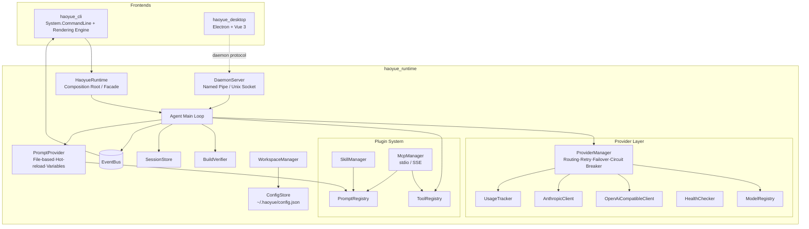

<p align="center">
  
</p>

<h1 align="center">Haoyue</h1>

<div align="center">

[](https://opensource.org/licenses/MIT)
[](https://dotnet.microsoft.com/)
[](https://www.npmjs.com/package/haoyue-cli)
[](https://github.com/Laogaodhck/haoyue/stargazers)
[](https://github.com/Laogaodhck/haoyue/network/members)
[](https://github.com/Laogaodhck/haoyue/issues)
[](https://github.com/Laogaodhck/haoyue/pulls)

**Modern, High-Performance AI Agent**

Haoyue is a high-performance AI agent built on .NET 10.0, featuring clean architecture and event-driven design. It ships with an out-of-the-box terminal CLI and desktop app, providing a complete platform for building AI-powered coding assistants with support for multiple LLM providers, tool execution, a knowledge base, session management, and a smooth interaction experience.

[🌐 Official Website & Docs](https://github.com/Laogaodhck/haoyue) •
[中文](README.md) •
[Getting Started](#-installation) •
[Features](#-features)

</div>

## ✨ Features

### 🚀 Runtime First Architecture

- **Clean Architecture**: Separation of concerns with `haoyue_runtime` as the core, and `haoyue_cli` (terminal) and `haoyue_desktop` (desktop) as frontends
- **Resident Daemon**: the daemon exposes JSON-RPC over Named Pipe / Unix Socket; the desktop app and CLI share the same runtime
- **Plugin System**: Tools, Skills, Prompts, and MCP (Model Context Protocol) — a four-layer extension mechanism
- **Event-Driven**: Decoupled rendering and business logic via event bus

### 🤖 Multi-Provider Support

- **OpenAI Compatible**: GPT-5.5, GPT-5.5-mini, and all OpenAI-compatible APIs
- **Anthropic**: Claude Opus, Claude Sonnet, Claude Haiku
- **Google**: Gemini Pro, Gemini Flash
- **Local Models**: Ollama, LM Studio, or run GGUF models directly in-process (no server required)
- **Routing**: Fast, Balanced, Quality, Cheap, Offline strategies
- **Failover**: Automatic retry with exponential backoff and circuit breaker

### 🛠️ Tool Ecosystem

- **Files & Execution**: File read/write/edit with precise diff application, grep/glob search, bash execution
- **Networking**: Web search (web_search) and web fetch (web_fetch)
- **Task Planning**: Built-in plan tool maintaining a task list with multi-step progress tracking
- **Screen Capture**: Screenshot tool that hands screen content to the model for analysis
- **MCP Support**: stdio and SSE transports with automatic tool/prompt/resource discovery; prompt and resource contents are injected into context (trimmed to the injection token budget, degrading gracefully on read failure)
- **Skills**: Directory-based skill system; manifest v2 adds trigger keywords, tool allow-lists, and parameter collection

### 🧠 Knowledge Base & Memory

- **Automatic Curation**: The agent saves, searches, and forgets knowledge in conversation (knowledge_save / knowledge_search / knowledge_forget)
- **Fault-Tolerant Retrieval**: Synonym expansion, full/half-width normalization, CJK bigram tokenization, and edit-distance fallback — typos, mixed CJK/Latin input, and full-width text still hit
- **Custom Synonyms**: A user-editable synonym table (`~/.haoyue/knowledge/synonyms.txt`) with hot reload, tailored for vertical-domain jargon
- **Rules & Memory**: AGENTS.md workspace rules injected automatically (toggleable); MEMORY.md long-term memory in auto or manual mode
- **Visual Maintenance**: The desktop knowledge base page supports entry CRUD, document import, and live search

### 🖥️ Desktop App

- **Modern UI**: Electron + Vue 3 + TypeScript with streaming markdown, image preview, and reasoning depth control
- **Expert System**: Built-in domain experts with one-click role presets
- **Visual Configuration**: Providers, models, profiles, and MCP servers fully managed in the UI
- **Task Management**: Scheduled tasks and archived runs, with instant desktop notifications and webhook callbacks on failure
- **Usage Analytics**: Token usage trends and model distribution charts

### 💻 Modern Terminal Experience

- **Game-style Rendering**: 30-60 FPS refresh with double buffering
- **Streaming Output**: Real-time token streaming with thinking/reasoning display
- **Live UI**: Spinner, progress bars, tool status, and markdown rendering
- **Incremental Updates**: No flickering, no scrolling, smooth animations

### 📁 Workspace Management

- **Project Detection**: Automatic recognition of Git, .NET, Node.js, Python, Rust, Go, Unity, Vue projects
- **Isolated Config**: Per-workspace configuration, cache, and memory with workspace-scoped sessions
- **Bootstrap**: Automatic project setup with `.haoyue/` directory structure

### 🌐 Website & Skill Market

- **Bilingual Docs**: Online documentation site in Chinese and English
- **Skill Market**: Browse, search, and submit skill shares; the desktop app can install official skills
- **Accounts**: Registration, login, and admin console with cookie auth and rate limiting

### 🔧 Developer Experience

- **Session Management**: SQLite-backed persistence, restoration, and concurrent access, with full-text search across titles and message bodies (ranked by hit count and recency)
- **Memory System**: Workspace-specific memory with automatic context injection
- **Verification**: Automatic build/check/repair cycle with multi-step command chains (run in order with fail-fast; the failing step's error-line summary feeds the repair prompt)
- **Hot Reload**: Prompt files and configurations reload without restart

## 📦 Installation

### Install the CLI via npm (recommended)

The published `haoyue-cli` package is a self-contained .NET binary. It can be used immediately after installation without a separate .NET SDK. The npm package currently provides the Windows x64 platform binary.

Prerequisites:

- Node.js 18 or later
- Git (for workspace detection)

```powershell
npm install -g haoyue-cli

# Verify the installation
haoyue --version

# Start interactive chat
haoyue
```

You can also run one-shot tasks and administration commands:

```powershell
haoyue "Explain the architecture of this project"
haoyue --continue
haoyue doctor
```

### Build from Source

Building from source requires:

- .NET 10.0 SDK or later
- Git (for workspace detection)

```bash
git clone https://github.com/Laogaodhck/haoyue.git
cd haoyue
dotnet build
```

### Run from Source

```bash
# Interactive chat mode
dotnet run --project haoyue_cli

# One-shot prompt
dotnet run --project haoyue_cli -- "Explain the architecture of this project"

# Continue previous session
dotnet run --project haoyue_cli -- --continue

# Resume specific session
dotnet run --project haoyue_cli -- --resume <session-id>

# Override model
dotnet run --project haoyue_cli -- --model "openai/gpt-5.5"
```

## 🏗️ Architecture



## 📁 Project Structure

```
Haoyue/
├── haoyue_cli/           # CLI frontend
│   ├── Commands/           # CLI commands (provider, model, profile, knowledge, schedule, etc.)
│   ├── Ui/                 # Terminal rendering engine
│   └── Program.cs          # Entry point
├── haoyue_runtime/       # Core runtime
│   ├── Agents/             # Agent loop and context planning
│   ├── ComputerUse/        # Screen capture
│   ├── Configuration/      # Config management
│   ├── Daemon/             # Daemon (Named Pipe / Unix Socket JSON-RPC)
│   ├── Data/               # Data layer (knowledge store, import, and search ranking)
│   ├── Events/             # Event bus system
│   ├── Experts/            # Expert system
│   ├── Mcp/                # MCP client implementation
│   ├── Prompts/            # Prompt loading and composition
│   ├── Providers/          # LLM provider integrations
│   ├── Scheduling/         # Scheduled tasks
│   ├── Sessions/           # Session persistence
│   ├── Skills/             # Skill management
│   ├── Tools/              # Tool registry and implementations
│   ├── Verification/       # Build verification
│   └── Workspaces/         # Workspace detection and management
├── haoyue_desktop/       # Desktop app (Electron + Vue 3 + TypeScript)
├── haoyue_webserver/     # Website & skill market (Blazor Server + SQLite)
├── haoyue_website/       # Docs site source (VitePress)
├── haoyue_tests/         # Runtime unit tests
├── haoyue_cli_tests/     # CLI tests
├── models/               # Local GGUF models (dev environment)
└── packaging/            # Packaging scripts and configuration
```

## ⚙️ Configuration

### Global Configuration

Located at `~/.haoyue/config.json`:

```json
{
  "providers": {
    "openai": {
      "apiKey": "sk-...",
      "baseUrl": "https://api.openai.com/v1"
    },
    "anthropic": {
      "apiKey": "sk-ant-..."
    }
  },
  "profiles": {
    "default": {
      "provider": "openai",
      "model": "gpt-5.5"
    }
  },
  "agent": {
    "maxSteps": 10,
    "maxRepairAttempts": 3,
    "autoVerify": true
  }
}
```

### Workspace Configuration

Each project can have `.haoyue/config.json` to override:

- Provider and model selection
- Temperature and context settings
- Tool permissions
- Skill configurations
- MCP server settings

## 🎯 Usage Examples

### Interactive Chat

```bash
haoyue chat
# or simply
haoyue
```

### One-shot Tasks

```bash
haoyue "Refactor the authentication module to use JWT"
haoyue "Write unit tests for the UserService class"
haoyue "Fix the build errors in the project"
```

### Provider Management

```bash
haoyue provider list
haoyue provider add openai --api-key sk-...
haoyue provider test openai
haoyue provider use anthropic
```

### Local Models (GGUF)

Drop GGUF files into `~/.haoyue/models` (or the `models/` folder of a repository checkout) to run them in-process with no network and no server:

```bash
haoyue provider add --id local --kind local --model DeepSeek-R1-0528-Qwen3-8B-Q4_K_M.gguf
```

Use `--models-directory` to point at a different folder. Local models support streaming and thinking output; tool calling is not supported yet.

Local inference tuning (provider options in `~/.haoyue/config.json`):

```json
{
  "providers": {
    "local": {
      "kind": "local",
      "modelsDirectory": "~/.haoyue/models",
      "gpuLayers": 0,
      "threads": 8,
      "localPrefixReuse": true
    }
  }
}
```

- `gpuLayers`: number of layers offloaded to GPU (llama.cpp `n_gpu_layers`). Defaults to `0` (CPU only). Install a CUDA backend (e.g. `LLamaSharp.Backend.Cuda12`) and set it to `999` to offload everything; the value is ignored when no GPU backend is present.
- `threads`: CPU inference thread count. Defaults to llama.cpp auto-selection (all logical cores).
- `localPrefixReuse`: reuse decoded KV prefixes across requests. In multi-step agent turns each step only decodes the newly appended suffix tokens, skipping repeated prefill of the system prompt and history for significantly higher throughput. Falls back to full recomputation automatically when the prefix mismatches or the backend does not support memory moves, with identical results.

### Model Management

```bash
haoyue model list
haoyue model use openai/gpt-5.5
haoyue model info claude-opus
haoyue model search "fast coding model"
```

### Session Management

```bash
haoyue session list
haoyue session resume <session-id>
haoyue session export <session-id> --format json
```

Sessions and the Desktop project list are stored in `~/.haoyue/haoyue.db`. On first access after upgrading, legacy `.session/*.jsonl`, `.haoyue/sessions/*.jsonl`, and global `~/.haoyue/sessions/*.jsonl` files are imported automatically and retained as backups. Provider, model, profile, MCP, skill, and workspace configuration remains in the existing JSON/text files; usage records remain in `~/.haoyue/usage.jsonl`.

### Knowledge Base & Data Management

The CLI ships management commands for the knowledge base, workspace rules, memory, experts, and scheduled tasks:

```bash
# Knowledge base: search, capture, and maintenance (content can be piped in)
haoyue knowledge search "deployment workflow"
haoyue knowledge add "Release steps" --tags ops,release
haoyue knowledge list

# Workspace rules (hierarchical AGENTS.md discovery and editing)
haoyue rules list
haoyue rules set

# Long-term memory (--global targets the global memory file)
haoyue memory show
haoyue memory set "Run the full test suite before releasing this repo"

# Built-in expert catalog
haoyue expert list

# Scheduled tasks (an 8-char short id prefix locates a task)
haoyue schedule add "Daily report" "0 9 * * *" "Summarize yesterday's commits into a report"
haoyue schedule list
haoyue schedule enable <id>
```

### Health Check

```bash
haoyue doctor
```

## 🔌 Extending Haoyue

### Adding Tools

Implement the `ITool` interface:

```csharp
public class MyTool : ITool
{
    public string Name => "my_tool";
    public string Description => "Does something useful";
    public JsonElement ParameterSchema => /* JSON schema */;
    public bool Mutating => false;
    public string StatusLabel => "Running my tool";
    
    public async Task<ToolResult> ExecuteAsync(
        JsonObject args, ToolContext ctx, CancellationToken ct)
    {
        // Implementation
    }
}
```

### Creating Skills

Create a directory in `skills/`:

```
skills/
  my-skill/
    skill.yaml          # Metadata and configuration
    prompt.txt          # Prompt template
    tools/              # Optional tool implementations
```

`skill.yaml` supports optional v2 fields that control injection behavior:

```yaml
name: my-skill
description: One line describing when this skill applies
triggers:            # When declared, the skill is injected only if the user message hits a keyword; otherwise it is always injected
  - deploy
  - release
allowed-tools:       # Tool allow-list while the skill is injected; undeclared means unrestricted
  - bash
  - read_file
parameters:          # Appends a parameter-collection appendix to the injected prompt
  - name: env
    description: Target deployment environment
    required: true
```

### MCP Servers

Configure in `mcp/servers.json`:

```json
{
  "servers": {
    "my-server": {
      "command": "node",
      "args": ["path/to/server.js"],
      "transport": "stdio"
    }
  }
}
```

Prompts and text resources exposed by the server are registered automatically as context contributions to the system prompt: contents are trimmed to the injection token budget, at most 16 resources per server are injected, and failed reads degrade gracefully without affecting the session.

## 🧪 Testing

```bash
# Run all tests
dotnet test haoyue_tests

# Run specific test class
dotnet test haoyue_tests --filter "ClassName=ProviderTests"
```

## 📊 Monitoring

Haoyue includes built-in monitoring:

- **Usage Tracking**: Token counts, costs, response times
- **Health Checks**: Provider availability and latency
- **Circuit Breaker**: Automatic failure detection and recovery
- **Session Analytics**: Conversation history and patterns

## 📄 License

This project is licensed under the MIT License - see the [LICENSE](LICENSE) file for details.

## 🙏 Acknowledgments

- Built with .NET 10.0 and System.CommandLine
- Uses Spectre.Console for terminal rendering
- Follows clean architecture and vertical slice patterns
- Designed with Native AOT compatibility in mind

## 👤 Author

**老高 (Lao Gao)** · QQ: 846193

---

**Haoyue** - A modern, high-performance AI agent built on .NET.
